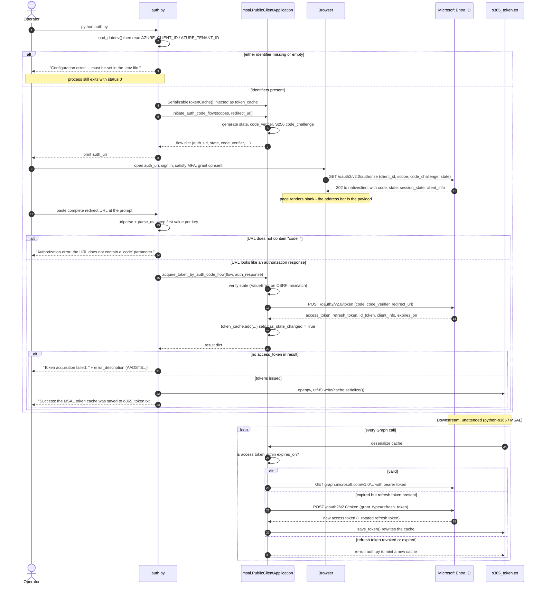
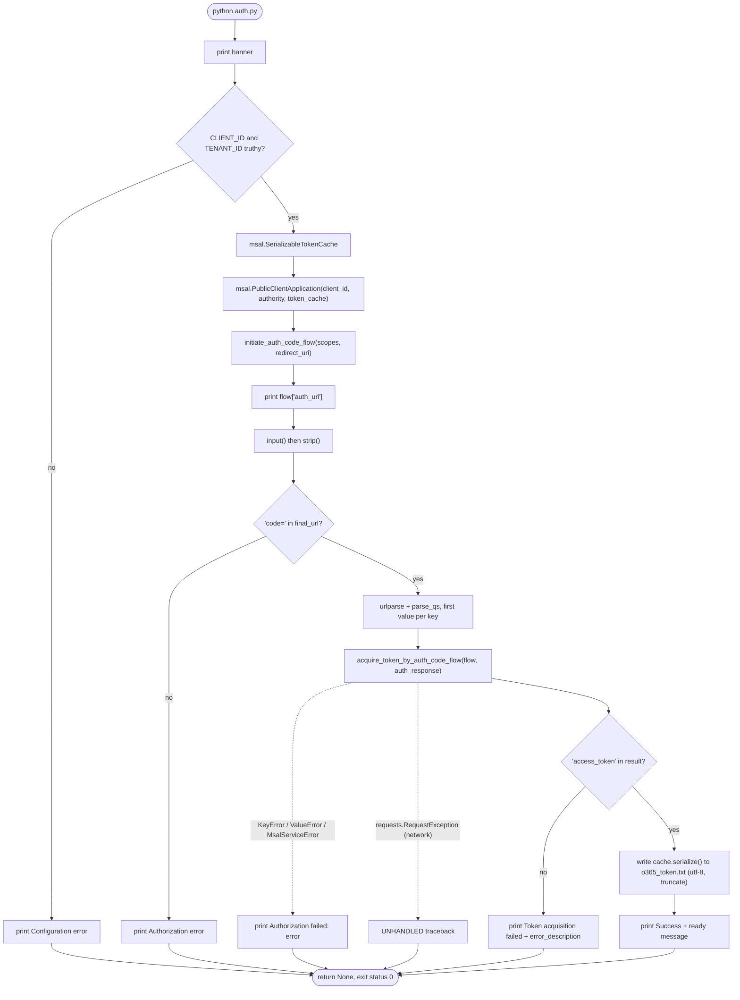
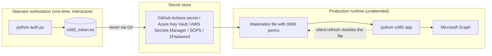
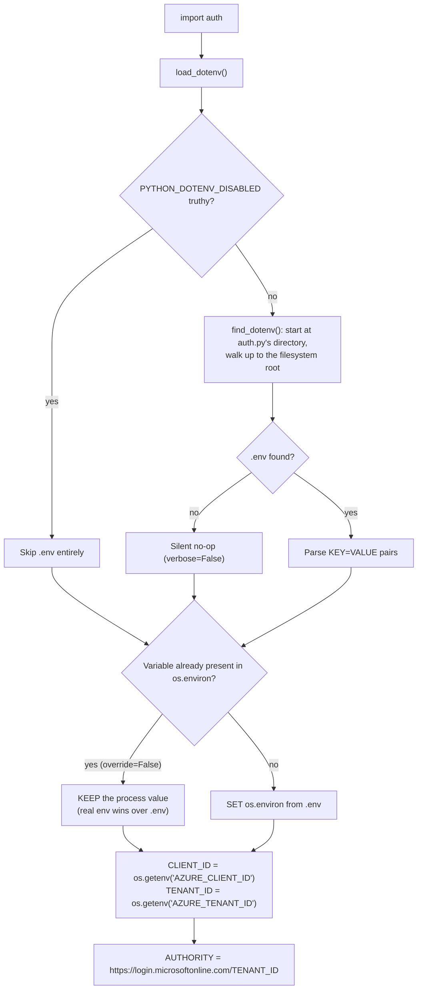

# O365 MSAL Token Cache Generator

> **A single-purpose, dependency-light Python CLI that performs one interactive Microsoft identity platform sign-in and emits a fully serialized MSAL token cache (`o365_token.txt`) that the [python-o365](https://github.com/O365/python-o365) library can consume for unattended, long-lived delegated access to Microsoft 365 mail.**

[](LICENSE)
[](https://www.python.org/downloads/)
[](https://github.com/AzureAD/microsoft-authentication-library-for-python)
[](https://learn.microsoft.com/en-us/entra/identity-platform/v2-oauth2-auth-code-flow)
[](#prerequisites)
[](#configuration)
[](#support-the-project)
[](https://github.com/adops-tool/o365-msal-token-cache-generator/pulls)

This repository contains **one executable script** ([`auth.py`](auth.py), ~123 lines) whose only job is to mint a *reusable credential artifact*. It exists for applications that need **delegated** (on-behalf-of-a-user) access to a Microsoft 365 mailbox but cannot — or must not — rely on python-o365's own interactive authentication prompt: headless servers, cron jobs, containers, CI runners, Windows services, AWS Lambda, and any runtime where `input()` and a local browser are unavailable.

The tool opens an OAuth 2.0 **authorization-code flow with PKCE** through MSAL's `PublicClientApplication`, prints the sign-in URL, accepts the final native-client redirect URL pasted back into the terminal, exchanges the one-time authorization code for tokens, and writes MSAL's *complete* cache representation to disk. Because a full cache (access tokens **plus** refresh tokens **plus** account metadata) is persisted rather than an isolated access token, downstream MSAL-backed clients can silently renew access for weeks without another human sign-in.

> [!NOTE]
> No CI/CD pipeline is currently configured for this repository, so no *build status* or *coverage* badge is displayed above — publishing one would be misleading. A ready-to-adopt GitHub Actions workflow (lint, type-check, security scan, unit tests across a Python matrix) is provided in [Testing](#testing), and secret-injection patterns for production pipelines in [Deployment](#deployment).

---

## Table of Contents

- [Features](#features)
- [Tech Stack & Architecture](#tech-stack--architecture)
  - [Core Technologies](#core-technologies)
  - [Project Structure](#project-structure)
  - [Key Design Decisions](#key-design-decisions)
  - [Logging Pipeline and Diagnostics](#logging-pipeline-and-diagnostics)
- [Getting Started](#getting-started)
  - [Prerequisites](#prerequisites)
  - [Installation](#installation)
  - [Verify the Installation](#verify-the-installation)
- [Testing](#testing)
  - [Static Analysis, Linting and Type Checks](#static-analysis-linting-and-type-checks)
  - [Manual Smoke Test Protocol](#manual-smoke-test-protocol)
  - [Artifact Validation](#artifact-validation)
- [Deployment](#deployment)
  - [Deployment Model](#deployment-model)
  - [CI/CD Pipeline Integration](#cicd-pipeline-integration)
  - [Containerization](#containerization)
  - [Security, Secret Handling and Rotation](#security-secret-handling-and-rotation)
- [Usage](#usage)
  - [Basic Usage](#basic-usage)
  - [Consuming the Cache from python-o365](#consuming-the-cache-from-python-o365)
  - [Advanced Usage](#advanced-usage)
  - [Edge Cases and Troubleshooting](#edge-cases-and-troubleshooting)
- [Configuration](#configuration)
  - [Environment Variables](#environment-variables)
  - [In-Code Constants](#in-code-constants)
  - [Resolution Order and Discovery Rules](#resolution-order-and-discovery-rules)
  - [Serialized Cache Schema](#serialized-cache-schema)
- [License](#license)
- [Support the Project](#support-the-project)

---

## Features

**Authentication protocol**

- **OAuth 2.0 authorization-code flow with PKCE** driven by `msal.PublicClientApplication` — MSAL generates the `code_verifier`/`code_challenge` pair automatically, so the exchange is protected against authorization-code interception without any client secret.
- **Public client (native app) profile.** No client secret is created, stored, transmitted, or rotated. This is the Microsoft-recommended pattern for code that runs on an operator's device or inside a container image.
- **Native-client redirect URI** (`https://login.microsoftonline.com/common/oauth2/nativeclient`) — no local HTTP listener is bound, no port is opened, no firewall rule or `localhost` callback registration is required. The final redirect page may render blank; the *address bar* is the transport.
- **Tenant-scoped authority** built from `AZURE_TENANT_ID` (`https://login.microsoftonline.com/{tenant_id}`), so sign-in is pinned to your directory instead of the multi-tenant `common` endpoint.
- **Least-privilege delegated scopes** out of the box: `Mail.ReadWrite`, `Mail.Send`, `User.Read`.
- **Automatic refresh-token acquisition.** MSAL silently decorates every interactive/auth-code request with the reserved scopes `openid`, `profile` and `offline_access`, which is why the resulting cache contains a long-lived refresh token even though `offline_access` is deliberately absent from the `SCOPES` constant.
- **CSRF/state validation** is delegated to MSAL: the `state` value from `initiate_auth_code_flow()` is checked against the `state` returned by the identity provider before the code is redeemed.

**Credential artifact**

- Emits **`o365_token.txt`**, which is exactly the default filename expected by python-o365's `FileSystemTokenBackend` — drop-in compatible, zero glue code.
- Persists the **entire MSAL cache** via `msal.SerializableTokenCache.serialize()`: `AccessToken`, `RefreshToken`, `IdToken`, `Account` and `AppMetadata` sections, including `expires_on`, `extended_expires_on`, `cached_at`, `client_info`, `home_account_id`, `realm` and `target` metadata required for silent renewal.
- UTF-8, 4-space-indented JSON — machine-readable by any MSAL-compatible client, and human-auditable for expiry checks.
- **Idempotent overwrite semantics**: each successful run truncates and rewrites the artifact, so a re-run always yields a fresh, self-consistent cache (no partial merges).

**Operational ergonomics**

- **Works headless and over SSH.** Because the browser round-trip is manual copy/paste rather than a loopback redirect, you can sign in on a laptop and complete the flow on a remote server with no X forwarding, no tunnel, and no browser on the host.
- **12-factor configuration** through `.env` (`python-dotenv`) with real environment variables taking precedence — the same script runs unmodified in a shell, a container, or a CI job.
- **Fail-fast validation**: missing `AZURE_CLIENT_ID` / `AZURE_TENANT_ID` is detected *before* any network call or MSAL application construction, with an actionable message.
- **Explicit, human-readable console diagnostics** at every branch (configuration error, missing `code` parameter, token-acquisition failure, service exception, success) — see [Logging Pipeline and Diagnostics](#logging-pipeline-and-diagnostics).
- **Credential-safe error reporting**: failures surface the identity provider's `error_description` (e.g. an `AADSTS` code) while never printing tokens, the serialized cache, or the pasted redirect URL.
- **No telemetry, no analytics, no third-party endpoints.** The only outbound traffic goes to `login.microsoftonline.com`.

**Engineering properties**

- **Zero framework lock-in.** Runtime dependencies are limited to `msal` and `python-dotenv`; everything else is Python standard library (`os`, `urllib.parse`).
- **Single-file module**, no packaging metadata, no import-time side effects beyond `load_dotenv()` — trivially auditable, trivially vendored.
- **Cross-platform**: Windows, Linux and macOS, Python 3.9+ (MSAL 1.39 baseline).
- **Git hygiene shipped in the box**: `.gitignore` already excludes `.env` and `o365_token.txt`, so the first accidental commit of a credential is prevented by default.
- **Apache License 2.0** — permissive for commercial, internal and redistributed use.

---

## Tech Stack & Architecture

### Core Technologies

| Layer | Technology | Version / Constraint | Role |
| --- | --- | --- | --- |
| Language | Python | `>= 3.9` (validated up to 3.13) | Runtime for `auth.py` |
| Auth SDK | [`msal`](https://pypi.org/project/msal/) | `1.39.0` (latest at time of writing), `Requires-Python >= 3.9`, MIT | `PublicClientApplication`, `SerializableTokenCache`, PKCE, state validation, token exchange |
| Config | [`python-dotenv`](https://pypi.org/project/python-dotenv/) | `1.2.3` on Python ≥ 3.10, `1.2.1` on Python 3.9, BSD-3-Clause | `.env` discovery and loading |
| Transitive | `requests`, `PyJWT[crypto]`, `cryptography` | pulled in by `msal` | HTTPS transport, ID-token decoding, crypto primitives |
| Identity provider | Microsoft Entra ID (formerly Azure AD) | v2.0 endpoint | `/oauth2/v2.0/authorize`, `/oauth2/v2.0/token` |
| Resource API | Microsoft Graph | `v1.0` | Consumed *downstream* by python-o365, not by this tool |
| Downstream client | [python-o365](https://github.com/O365/python-o365) | MSAL-based releases (`O365.utils.token`) | Consumes `o365_token.txt` via `FileSystemTokenBackend` |
| Standard library | `os`, `urllib.parse` | — | Environment access, redirect-URL query parsing |

> [!IMPORTANT]
> `requirements.txt` intentionally ships **unpinned** requirements (`msal`, `python-dotenv`). This keeps the tool current with Microsoft's security fixes but makes builds non-reproducible. For production or CI use, generate a lock file — see [Installation](#installation).

### Project Structure

```text
o365-msal-token-cache-generator/
├── auth.py               # CLI entry point: interactive auth-code + PKCE flow (123 lines)
├── requirements.txt      # Runtime dependencies: msal, python-dotenv
├── .env                  # LOCAL, git-ignored: AZURE_CLIENT_ID, AZURE_TENANT_ID
├── .gitignore            # Excludes .env, o365_token.txt, venvs, __pycache__, *.py[cod]
├── cmd_commands.txt      # Windows cheat-sheet of setup/run commands
├── LICENSE               # Apache License, Version 2.0
├── README.md             # This document
└── o365_token.txt        # GENERATED, git-ignored: serialized MSAL token cache artifact
```

<details>
<summary><strong>Annotated file tree with responsibilities, encoding notes and internal layout of <code>auth.py</code></strong></summary>

```text
o365-msal-token-cache-generator/
│
├── auth.py                     ← the entire application
│   ├── Module docstring        ← contract: what is produced and why it must be treated as a credential
│   ├── Imports                 ← os, urllib.parse (stdlib); msal, dotenv.load_dotenv,
│   │                              msal.exceptions.MsalServiceError (third-party)
│   ├── load_dotenv()           ← executed at IMPORT time (side effect)
│   ├── CLIENT_ID               ← os.getenv("AZURE_CLIENT_ID")            [module constant]
│   ├── TENANT_ID               ← os.getenv("AZURE_TENANT_ID")            [module constant]
│   ├── AUTHORITY               ← f"https://login.microsoftonline.com/{TENANT_ID}"
│   ├── SCOPES                  ← ["Mail.ReadWrite", "Mail.Send", "User.Read"]
│   ├── REDIRECT_URI            ← "https://login.microsoftonline.com/common/oauth2/nativeclient"
│   ├── TOKEN_CACHE_PATH        ← "o365_token.txt"
│   └── main() -> None          ← orchestration: validate → build cache → build app →
│                                  initiate flow → prompt → parse → exchange → persist
│       └── if __name__ == "__main__": main()
│
├── requirements.txt            ← 2 lines, CRLF endings, NO trailing newline, no version pins
│                                  (pip parses CRLF correctly; harmless on Linux/macOS)
├── cmd_commands.txt            ← 4 lines, CRLF: venv create, pip install, activate, run
├── .gitignore                  ← 9 lines: secrets first, then venv/bytecode artifacts
├── LICENSE                     ← Apache-2.0 full text (appendix copyright line is still the
│                                  "[yyyy] [name of copyright owner]" placeholder)
└── README.md
```

**Files that do *not* exist (by design):** `pyproject.toml`, `setup.py`, `setup.cfg`, `__init__.py`, `tests/`, `Dockerfile`, `.github/workflows/`, `Makefile`, `CHANGELOG.md`. This is a *script*, not an installable distribution — see [Key Design Decisions](#key-design-decisions). Templates for the CI, test and container artifacts you may want to add are in [Testing](#testing) and [Deployment](#deployment).

</details>

### Key Design Decisions

Six decisions define the shape of this tool. Each is expanded below with its rationale and the trade-off that was consciously accepted.

<details>
<summary><strong>DD-1 — Public client + PKCE instead of a client secret</strong></summary>

A client secret on a developer laptop, in a container layer, or in a Git history is a credential leak waiting to happen. Microsoft's guidance for anything that cannot guarantee secret confidentiality is a **public client**: the user's interactive sign-in *is* the authentication event, and PKCE (mandatory for public clients on the v2.0 endpoint) binds the authorization code to the process that requested it. Consequence: `msal.PublicClientApplication(CLIENT_ID, authority=..., token_cache=...)` — no `client_credential` argument, and the Entra app registration must have **Allow public client flows = Yes**.

Trade-off accepted: this flow *cannot* be fully unattended. It requires one human sign-in per credential lifetime. For truly headless, machine-to-machine scenarios the correct pattern is a confidential client with the *client-credentials* grant and application (not delegated) permissions — a different tool, outside this repository's scope.

</details>

<details>
<summary><strong>DD-2 — Persist the whole MSAL cache, not the access token</strong></summary>

An access token is a ~60–90 minute bearer credential. Serializing only the token would force a fresh interactive sign-in every hour, defeating the purpose. `msal.SerializableTokenCache` writes MSAL's canonical cache shape:

```jsonc
{ "AccessToken": { ... }, "RefreshToken": { ... }, "IdToken": { ... }, "Account": { ... }, "AppMetadata": { ... } }
```

The `RefreshToken` and `Account` sections are what make unattended operation possible: the consuming application calls MSAL's silent acquisition path, presents the refresh token, receives a new access token (and usually a rotated refresh token), and rewrites the file. This is precisely the contract python-o365's `BaseTokenBackend` implements — it subclasses `msal.token_cache.TokenCache` and searches that same structure by `home_account_id`.

Trade-off accepted: the artifact is now a **high-value credential** (see [Security, Secret Handling and Rotation](#security-secret-handling-and-rotation)). Encryption at rest is the operator's responsibility; MSAL's own docs point to [`msal-extensions`](https://github.com/AzureAD/microsoft-authentication-extensions-for-python) for OS-keychain-backed persistence, with a snippet in [Advanced Usage](#advanced-usage).

</details>

<details>
<summary><strong>DD-3 — Copy/paste redirect instead of a loopback listener</strong></summary>

MSAL offers `acquire_token_interactive()`, which spawns a system browser and binds a local HTTP server to catch the redirect. That is friendlier on a desktop and unusable everywhere else: SSH sessions, containers, CI agents, Windows services, Lambda, and hosts behind locked-down firewalls. This tool instead uses the two-call pattern `initiate_auth_code_flow()` → `acquire_token_by_auth_code_flow()`, with the human acting as the redirect transport.

Consequences worth knowing:

- No port binding, no `localhost` URI registration, no admin rights, no browser on the host.
- The flow state (including `code_verifier` and `state`) lives **only in process memory**; if the script exits before you paste the URL, that authorization code can never be redeemed.
- The pasted URL must be **complete** — truncation by a terminal or clipboard manager breaks `parse_qs` and yields `invalid_grant`.

</details>

<details>
<summary><strong>DD-4 — Environment-driven identity, code-resident policy</strong></summary>

Only the two values that legitimately differ per environment (`AZURE_CLIENT_ID`, `AZURE_TENANT_ID`) come from configuration. The security-relevant policy — `SCOPES`, `REDIRECT_URI`, `TOKEN_CACHE_PATH` — is a module constant. This is deliberate: a typo'd scope or redirect URI in a `.env` file produces a confusing `AADSTS50011`/consent failure at the worst possible moment, and silently broadening scopes from configuration defeats least privilege. Changing policy is a code review, not an environment edit.

Trade-off accepted: multi-tenant or multi-mailbox operators must edit constants or parameterize `main()` themselves — recipes are in [Advanced Usage](#advanced-usage).

</details>

<details>
<summary><strong>DD-5 — <code>print()</code> to stdout instead of the <code>logging</code> framework</strong></summary>

This is a one-shot, foreground, human-attended CLI with exactly eight distinct messages. Adopting `logging` would add handler/formatter/level configuration surface for no operator benefit, and — more importantly — would invite the classic credential-leak pattern of a debug-level dump of the MSAL response or cache into a log file that outlives the session. Every message is a deliberate, reviewed `print()` to **stdout** (never stderr), and none of them interpolates a token, the authorization code, or the cache payload.

Trade-off accepted: exit status is always `0` and messages are not machine-parseable. Automation must assert on the **artifact**, not the exit code — see the warning in [CI/CD Pipeline Integration](#cicd-pipeline-integration).

</details>

<details>
<summary><strong>DD-6 — No packaging, no CLI framework, no argument parser</strong></summary>

There are no flags to parse: the tool has exactly one behaviour and two configuration inputs. Adding `argparse`, `click`, `pyproject.toml` or console-script entry points would multiply the install and audit surface for a script whose value is that it can be read end-to-end in two minutes and vendored into an internal repository verbatim.

</details>

#### End-to-End Data Flow

The happy path, end to end:

```mermaid
flowchart LR
    ENV[".env / process env<br/>AZURE_CLIENT_ID<br/>AZURE_TENANT_ID"] --> CFG["Module constants<br/>AUTHORITY, SCOPES<br/>REDIRECT_URI, TOKEN_CACHE_PATH"]
    CFG --> APP["msal.PublicClientApplication<br/>+ SerializableTokenCache"]
    APP --> FLOW["initiate_auth_code_flow()<br/>state + PKCE code_verifier"]
    FLOW --> BR["Browser sign-in + consent<br/>at login.microsoftonline.com"]
    BR --> PASTE["Operator pastes final<br/>nativeclient redirect URL"]
    PASTE --> PARSE["urllib.parse.urlparse<br/>+ parse_qs (first value)"]
    PARSE --> EXCH["acquire_token_by_auth_code_flow()<br/>POST /oauth2/v2.0/token"]
    EXCH --> CACHE["cache.add(...) in memory<br/>AT + RT + IdToken + Account"]
    CACHE --> ART[("o365_token.txt<br/>serialized MSAL cache")]
    ART --> O365["python-o365<br/>FileSystemTokenBackend"]
    O365 --> GRAPH["Microsoft Graph<br/>delegated mail operations"]
```



<details>
<summary><strong>Sequence diagram — full authorization-code + PKCE flow, including every failure branch and the downstream silent-refresh lifecycle</strong></summary>



</details>

<details>
<summary><strong>Control-flow diagram — exact branch structure and exit behaviour of <code>main()</code></strong></summary>



> [!WARNING]
> Note the `requests.RequestException` edge in the diagram: `auth.py` catches `KeyError`, `ValueError` and `MsalServiceError`, but a **transport-layer failure** during the token POST (DNS resolution failure, TLS interception by a corporate proxy, connection reset, timeout) is *not* caught and will surface as a raw Python traceback. The remedy is identical either way — restore connectivity and restart the script for a fresh authorization URL, since the code you pasted may or may not have reached the token endpoint.

</details>

### Logging Pipeline and Diagnostics

The tool emits a fixed, closed set of messages — all to **stdout** via `print()`, none containing credential material. Every possible output is enumerated below, which makes transcript-based assertions possible in smoke tests and support tickets.

| # | Trigger | Exact message (leading `\n` omitted) | Channel | Followed by exit |
| --- | --- | --- | --- | --- |
| 1 | Always, first statement | `--- MSAL TOKEN CACHE GENERATOR ---` | stdout | — |
| 2 | `CLIENT_ID` or `TENANT_ID` falsy | `Configuration error: AZURE_CLIENT_ID and AZURE_TENANT_ID must be set in the .env file.` | stdout | `0` |
| 3 | Flow initiated | `Open this authorization URL in your browser:` then `flow["auth_uri"]` | stdout | — |
| 4 | Awaiting paste | `Paste the complete URL from the final browser page here: ` (prompt, no newline) | stdout | — |
| 5 | `"code="` absent from input | `Authorization error: the URL does not contain a 'code' parameter.` | stdout | `0` |
| 6 | Token response without `access_token` | `Token acquisition failed: {error_description or "Azure AD returned an unspecified error."}` | stdout | `0` |
| 7 | `KeyError` / `ValueError` / `MsalServiceError` | `Authorization failed: {error}` | stdout | `0` |
| 8 | Success | `Success: the MSAL token cache was saved to o365_token.txt.` then `The cache is now ready for use by your O365 application.` | stdout | `0` |

> [!CAUTION]
> **Never redirect or `tee` a full session transcript into a log, ticket, or CI artifact.** Message 3 contains the authorization URL (which embeds your `client_id`, the PKCE `code_challenge` and the anti-CSRF `state`), and the URL you *paste* contains a live authorization code. Neither is as dangerous as the token cache, but both are authentication material and both belong in an ephemeral terminal only. If you must capture output for debugging, redact the `auth_uri` line and the pasted URL.

> [!TIP]
> Because message 8 is only printed on success and message 2/5/6/7 are printed on failure, a robust automation check is `test -s o365_token.txt` (plus a JSON validity check) — not `$?`. See [Artifact Validation](#artifact-validation).

---

## Getting Started

### Prerequisites

**Local machine**

| Requirement | Minimum | Notes |
| --- | --- | --- |
| Python | 3.9 | MSAL 1.39 declares `Requires-Python >= 3.9`. `python-dotenv` 1.2.2+ requires ≥ 3.10, so on 3.9 pip resolves `1.2.1` automatically. |
| pip | 21+ | `python -m pip install --upgrade pip` first; old pip mishandles `Requires-Python` metadata. |
| venv | bundled | `python -m venv` (Debian/Ubuntu: `sudo apt install python3-venv`). |
| Browser | any modern | Used for the sign-in only. It may run on a *different* machine than the script. |
| Network | outbound TLS/443 | To `login.microsoftonline.com`. The script itself never calls `graph.microsoft.com`. |
| Terminal | clipboard paste support | The redirect URL is ~500–900 characters; a truncated paste fails with `invalid_grant`. |

**Microsoft Entra ID tenant**

| Requirement | Where to configure | Notes |
| --- | --- | --- |
| An Entra ID tenant | — | Any Microsoft 365 business/enterprise subscription includes one. |
| App registration | Entra admin center → **App registrations** → **New registration** | Supported account type: *Accounts in this organizational directory only* (single tenant) is the safest choice. |
| **Allow public client flows = Yes** | App registration → **Authentication** → **Advanced settings** | Without this, the token request fails with `AADSTS7000218` (missing `client_assertion`/`client_secret`). |
| Redirect URI `https://login.microsoftonline.com/common/oauth2/nativeclient` | App registration → **Authentication** → **Mobile and desktop applications** | Must match `REDIRECT_URI` in `auth.py` **exactly**, character for character. Mismatch → `AADSTS50011`. |
| Delegated Microsoft Graph permissions | App registration → **API permissions** → **Add a permission** → Microsoft Graph → **Delegated permissions** | `Mail.ReadWrite`, `Mail.Send`, `User.Read`. |
| Granted consent | **API permissions** → **Grant admin consent** (or per-user consent at first sign-in) | Required if the tenant disables user consent. Ungranted → `AADSTS65001`. |
| A licensed Microsoft 365 mailbox | — | The signing-in user must have a mailbox, or `Mail.*` calls fail downstream with `ResourceNotFound`. |
| **No client secret** | — | Do **not** create one. It is unused by this tool and only adds a leak surface. |

<details>
<summary><strong>Step-by-step — creating a conforming app registration in the Entra admin center</strong></summary>

1. Open <https://entra.microsoft.com/> → **Identity** → **Applications** → **App registrations** → **+ New registration**.
2. **Name**: something auditable, e.g. `o365-mailer-public-client`. The name is cosmetic but appears in the consent screen.
3. **Supported account types**: select *Accounts in this organizational directory only (Single tenant)*. Choosing `common`/multi-tenant is only appropriate if you genuinely intend to accept external identities.
4. **Redirect URI**: choose platform **Public client/native (mobile & desktop)** and enter:

   ```text
   https://login.microsoftonline.com/common/oauth2/nativeclient
   ```

   > [!NOTE]
   > This URI is a Microsoft-reserved loopback-equivalent endpoint that renders a blank page. Using it is exactly what makes the copy/paste pattern work; it is *not* a typo and it is *not* your tenant's URL.

5. Click **Register**, then copy the **Application (client) ID** and the **Directory (tenant) ID** from the Overview blade. These become `AZURE_CLIENT_ID` and `AZURE_TENANT_ID`.
6. Go to **Authentication** → scroll to **Advanced settings** → set **Allow public client flows** to **Yes** → **Save**.
7. Go to **API permissions** → **+ Add a permission** → **Microsoft Graph** → **Delegated permissions** → search and tick:
   - `Mail.ReadWrite` — read, create, update, delete, move and flag mail in the signed-in user's mailbox.
   - `Mail.Send` — send mail as the signed-in user.
   - `User.Read` — read the signed-in user's profile (also needed to resolve the `home_account_id`).
   Click **Add permissions**.
8. If your tenant blocks user consent (common in enterprises), click **Grant admin consent for \<tenant\>** → **Yes**. The Status column should show a green checkmark for all three permissions.
9. Leave **Certificates & secrets** empty. A public client must not carry a secret.
10. Optional but recommended: leave **Token configuration** at its defaults, and review the **Manifest** blade. Expand the block below for a declarative equivalent of everything configured in steps 3–7.

<details>
<summary><strong>Equivalent app-registration manifest fragment (for declarative provisioning)</strong></summary>

If you provision app registrations with ARM/Bicep/Terraform or edit the manifest directly, the security-relevant properties are:

```json
{
  "allowPublicClient": true,
  "signInAudience": "AzureADMyOrg",
  "replyUrlsWithType": [
    {
      "url": "https://login.microsoftonline.com/common/oauth2/nativeclient",
      "type": "InstalledClient"
    }
  ],
  "requiredResourceAccess": [
    {
      "resourceAppId": "00000003-0000-0000-c000-000000000000",
      "resourceAccess": [
        { "id": "024d486e-b451-40bb-833d-3e66d98c5c73", "type": "Scope" },
        { "id": "e383f46e-2787-4529-855e-0e479a3ffac0", "type": "Scope" },
        { "id": "e1fe6dd8-ba31-4d61-89e7-88639da4683d", "type": "Scope" }
      ]
    }
  ]
}
```

| GUID | Meaning |
| --- | --- |
| `00000003-0000-0000-c000-000000000000` | Microsoft Graph resource application ID (fixed, global). |
| `024d486e-b451-40bb-833d-3e66d98c5c73` | `Mail.ReadWrite` — **delegated** scope ID. |
| `e383f46e-2787-4529-855e-0e479a3ffac0` | `Mail.Send` — **delegated** scope ID. |
| `e1fe6dd8-ba31-4d61-89e7-88639da4683d` | `User.Read` — **delegated** scope ID. |
| `"type": "Scope"` | Delegated permission. `"type": "Role"` would mean an *application* permission — not what this tool uses. |

> [!CAUTION]
> **Delegated and application permissions for the same name have different GUIDs.** For example, `Mail.ReadWrite` is `024d486e-b451-40bb-833d-3e66d98c5c73` as a *delegated* scope but `e2a3a72e-5f79-4c64-b1b1-878b674786c9` as an *application* role. Using the application GUID with `"type": "Scope"` yields an app registration that silently requests nothing useful. Microsoft can also change these IDs over time, so always verify against your own tenant before provisioning:
>
> ```powershell
> # List the delegated (OAuth2) scope IDs published by Microsoft Graph in your tenant
> (Get-MgServicePrincipal -Filter "appId eq '00000003-0000-0000-c000-000000000000'").Oauth2PermissionScopes |
>   Where-Object { $_.Value -in 'Mail.ReadWrite','Mail.Send','User.Read' } |
>   Select-Object Value, Id, AdminConsentRequired | Format-Table -AutoSize
> ```
>
> ```bash
> # Or via the Graph REST API
> curl -sS -H "Authorization: Bearer $GRAPH_TOKEN" \
>   "https://graph.microsoft.com/v1.0/servicePrincipals?\$filter=appId eq '00000003-0000-0000-c000-000000000000'&\$select=oauth2PermissionScopes"
> ```

</details>
</details>

### Installation

```bash
# 1. Clone the repository and enter it
git clone https://github.com/adops-tool/o365-msal-token-cache-generator.git
cd o365-msal-token-cache-generator

# 2. Create an isolated virtual environment (never install into the system interpreter)
python -m venv .venv

# 3a. Activate it — Linux / macOS
source .venv/bin/activate

# 3b. Activate it — Windows PowerShell
#     .venv\Scripts\Activate.ps1
# 3c. Activate it — Windows cmd.exe
#     .venv\Scripts\activate.bat

# 4. Upgrade pip, then install the two runtime dependencies
python -m pip install --upgrade pip
python -m pip install -r requirements.txt

# 5. Create your local configuration (this file is git-ignored by default)
cat > .env <<'EOF'
AZURE_CLIENT_ID=00000000-0000-0000-0000-000000000000
AZURE_TENANT_ID=00000000-0000-0000-0000-000000000000
EOF
chmod 600 .env          # Linux/macOS only — restrict to the owning user
```

Replace both GUID placeholders with the values from your app registration's **Overview** blade. The repository already ships a `.env` containing these placeholder GUIDs, so overwriting it is the intended workflow.

> [!TIP]
> Pin your environment for reproducibility after a known-good install:
>
> ```bash
> python -m pip freeze --exclude-editable > requirements.lock
> python -m pip install -r requirements.lock     # deterministic reinstall later
> ```
>
> Reference point for the versions this README was validated against: `msal==1.39.0`, `python-dotenv==1.2.3`.

<details>
<summary><strong>Alternative installation methods, offline installs, and troubleshooting</strong></summary>

**A. Install dependencies without the repository (vendoring `auth.py`)**

The script has no package structure, so you can drop `auth.py` next to any project:

```bash
python -m pip install msal python-dotenv
curl -fsSLO https://raw.githubusercontent.com/adops-tool/o365-msal-token-cache-generator/main/auth.py
python auth.py
```

**B. Air-gapped / offline installation via a wheelhouse**

```bash
# On a machine WITH internet access, targeting the same OS/Python as the server
mkdir wheelhouse
python -m pip download msal python-dotenv -d wheelhouse

# Transfer wheelhouse/ to the target host, then:
python -m pip install --no-index --find-links=wheelhouse msal python-dotenv
```

> [!WARNING]
> `cryptography` (a transitive MSAL dependency) ships platform-specific binary wheels. The wheelhouse must be built for the **same OS, architecture and Python minor version** as the target, or pip will fall back to a source build that requires a Rust toolchain and OpenSSL headers.

**C. Building MSAL from source**

```bash
git clone https://github.com/AzureAD/microsoft-authentication-library-for-python.git
cd microsoft-authentication-library-for-python
python -m pip install --editable .
cd -
python -m pip install python-dotenv
```

Useful only when reproducing an upstream issue or testing an unreleased fix. Do not do this in production — you lose published-wheel signatures and reproducible versioning.

**D. Dependency-free fallback**

`python-dotenv` exists solely to load `.env`. If you cannot install it, export the two variables in the shell and delete the `load_dotenv()` import/call from `auth.py`; `os.getenv()` will pick up the process environment directly. See [Resolution Order and Discovery Rules](#resolution-order-and-discovery-rules).

---

**Installation troubleshooting**

| Symptom | Root cause | Fix |
| --- | --- | --- |
| `ModuleNotFoundError: No module named 'msal'` | Venv not activated, or installed into a different interpreter | `which python` / `python -c "import sys; print(sys.executable)"` must point inside `.venv`. Re-run `pip install -r requirements.txt` with the venv active. |
| `error: externally-managed-environment` (Debian 12+, Ubuntu 23.04+, Fedora) | PEP 668 protects the system interpreter | Use a venv (preferred), or `pipx`, or `python -m pip install --user --break-system-packages msal python-dotenv` (last resort). |
| `python: command not found` / Python 2 invoked | Distro ships `python3` only | Use `python3 -m venv .venv` and `python3 auth.py`. |
| `No module named venv` / `ensurepip is not available` | Debian/Ubuntu split packaging | `sudo apt install python3-venv python3-full` (or `python3.11-venv`). |
| PowerShell: *"...Activate.ps1 cannot be loaded because running scripts is disabled"* | Execution policy | `Set-ExecutionPolicy -Scope CurrentUser -ExecutionPolicy RemoteSigned`, or use `.venv\Scripts\activate.bat` in cmd. |
| `SSLError` / `CERTIFICATE_VERIFY_FAILED` during pip install | Corporate TLS-inspecting proxy or missing CA bundle | `python -m pip install --cert /path/to/corporate-ca.pem -r requirements.txt`, or set `SSL_CERT_FILE`/`REQUESTS_CA_BUNDLE`. Never use `--trusted-host` in production. |
| pip times out behind a proxy | Proxy not configured for pip | `export HTTPS_PROXY=http://proxy.corp:8080` (Linux/macOS) or `$env:HTTPS_PROXY="http://proxy.corp:8080"` (PowerShell); optionally a `pip.conf`/`pip.ini` with `proxy = ...`. |
| macOS: `ssl.SSLCertVerificationError` at *runtime* | python.org installer without certificates | Run `/Applications/Python\ 3.x/Install\ Certificates.command`, or `pip install --upgrade certifi`. |
| Version conflict warnings for `python-dotenv` on Python 3.9 | `python-dotenv` ≥ 1.2.2 requires Python ≥ 3.10 | Expected and harmless: pip resolves `1.2.1`. Upgrade to Python 3.10+ if you want the newest release. |
| `auth.py` runs but prints the configuration error even though `.env` exists | `.env` not discoverable from `auth.py`'s directory, or `PYTHON_DOTENV_DISABLED` is set | Run from the repo root, verify the filename is exactly `.env`, and `unset PYTHON_DOTENV_DISABLED`. |
| Stale bytecode after editing `auth.py` | `__pycache__` from another interpreter | `find . -name '__pycache__' -type d -exec rm -rf {} +` (already git-ignored). |

</details>

### Verify the Installation

```bash
# Interpreter and dependency sanity check
python -c "import sys, msal, dotenv; print(sys.version.split()[0], msal.__version__ if hasattr(msal,'__version__') else 'msal ok', 'dotenv ok')"

# The module must import cleanly (this also executes load_dotenv() and builds AUTHORITY)
python -c "import auth; print('AUTHORITY =', auth.AUTHORITY); print('SCOPES =', auth.SCOPES); print('REDIRECT_URI =', auth.REDIRECT_URI)"

# Syntax/bytecode compile check
python -m py_compile auth.py && echo "compile OK"

# Confirm no secrets are staged for commit
git status --porcelain
git check-ignore -v .env o365_token.txt
```

Expected output of the second command (with a correctly populated `.env`):

```text
AUTHORITY = https://login.microsoftonline.com/11111111-2222-3333-4444-555555555555
SCOPES = ['Mail.ReadWrite', 'Mail.Send', 'User.Read']
REDIRECT_URI = https://login.microsoftonline.com/common/oauth2/nativeclient
```

> [!IMPORTANT]
> If `AUTHORITY` ends with `/None`, your `.env` was not discovered. `load_dotenv()` resolves `.env` **relative to the directory containing `auth.py`**, walking up toward the filesystem root — not relative to your shell's working directory. Keep `.env` beside `auth.py`.

---

## Testing

> [!IMPORTANT]
> **This repository does not currently ship an automated test suite.** There is no `tests/` directory, no `pytest.ini`/`pyproject.toml` test configuration, and no CI workflow. The critical path — an interactive browser sign-in against a live Microsoft Entra tenant — cannot be exercised by a hermetic unit test without mocking MSAL, and the shipped code is a 123-line script whose behaviour is fully enumerated in [Logging Pipeline and Diagnostics](#logging-pipeline-and-diagnostics).
>
> Quality assurance here is therefore a combination of (1) static analysis, (2) a documented manual smoke-test protocol, and (3) artifact validation. A drop-in mocked `pytest` suite and a CI workflow are provided below as ready-to-adopt templates.

### Static Analysis, Linting and Type Checks

These commands are safe to run at any time: they require no credentials, make no network calls, and never touch a token cache.

```bash
# Syntax / bytecode compilation (stdlib, always available)
python -m py_compile auth.py
python -m compileall -q .

# Dependency graph consistency
python -m pip check

# Lint + format (ruff — fast, single tool for both)
python -m pip install ruff
ruff check .                       # lint
ruff check . --fix                 # lint with autofix
ruff format --diff .               # preview formatting changes
ruff format .                      # apply

# Classic flake8 + black, if that is your house style
python -m pip install flake8 black
flake8 --max-line-length=100 --extend-ignore=E501 auth.py
black --check --diff --line-length 100 auth.py
black --line-length 100 auth.py

# Static type checking
python -m pip install mypy
mypy --strict auth.py
mypy --ignore-missing-imports auth.py       # lenient variant

# Security-oriented static analysis (credential handling, unsafe calls)
python -m pip install bandit
bandit -r auth.py -ll

# Known-vulnerability audit of the dependency set (network access required)
python -m pip install pip-audit
pip-audit -r requirements.txt
pip-audit                                            # audits the active environment

# Stale-dependency report
python -m pip list --outdated
```

| Tool | Purpose | Non-negotiable findings for this project |
| --- | --- | --- |
| `py_compile` | Syntax validity | Must pass — the script is shipped without any build step. |
| `ruff` / `flake8` | Style, unused imports, complexity | Keep `urllib.parse`, `os`, `msal`, `dotenv`, `MsalServiceError` imports used; no dead code. |
| `black` / `ruff format` | Deterministic formatting | Prevents noisy diffs in a security-audited file. |
| `mypy` | Type correctness | `main()` is annotated `-> None`; MSAL ships inline types. |
| `bandit` | Security anti-patterns | Confirm no `B105`/`B106` (hardcoded secret), no `B310`/`B301` concerns, and that file writes are not `B108` hardcoded temp paths. |
| `pip-audit` | CVE exposure | Run in CI; unpinned deps make this genuinely valuable. |

### Manual Smoke Test Protocol

Run these three negative tests first — they need no tenant access and cover every guard clause.

| # | Test | Setup | Action | Expected |
| --- | --- | --- | --- | --- |
| N1 | Missing configuration | `mv .env .env.bak` (and ensure the two vars are not exported) | `python auth.py` | Banner, then `Configuration error: AZURE_CLIENT_ID and AZURE_TENANT_ID must be set in the .env file.`; **no** network call; **no** `o365_token.txt`; exit status `0`; `AUTHORITY` was never used. Restore with `mv .env.bak .env`. |
| N2 | Empty configuration | `.env` containing `AZURE_CLIENT_ID=` and `AZURE_TENANT_ID=` | `python auth.py` | Identical to N1 — the guard uses truthiness, so empty strings are rejected. |
| N3 | Redirect URL without a code | Valid `.env` | Run the script, then paste `https://login.microsoftonline.com/common/oauth2/nativeclient` (or any string lacking `code=`) | `Authorization error: the URL does not contain a 'code' parameter.`; exit `0`; no file written. |
| N4 | Pasting the *authorization* URL back | Valid `.env` | Copy the printed `auth_uri` and paste it at the prompt | Same as N3 — `auth_uri` contains `code_challenge=` and `scope=` but never the literal `code=`, so it is correctly rejected. |
| N5 | OAuth error redirect | Valid `.env` | Sign in, then **deny** consent (or trigger an error) and paste the resulting `?error=access_denied&error_description=...` URL | Reported as N3. **Known limitation:** the guard discards the `error_description`, so inspect the pasted URL yourself for `error=` to learn why. |
| P1 | Happy path | Valid `.env`, correct app registration, licensed mailbox | Full run: open URL → sign in → consent → blank page → paste full address-bar URL → Enter | `Success: the MSAL token cache was saved to o365_token.txt.` + `The cache is now ready for use by your O365 application.`; file exists and is non-empty. |
| P2 | Reuse / idempotence | Existing `o365_token.txt` from P1 | Run P1 again | The file is truncated and rewritten (mtime changes); old cache content is fully replaced. |
| P3 | Downstream integration | Artifact from P1 | Load it in python-o365 per [Consuming the Cache from python-o365](#consuming-the-cache-from-python-o365) and read the mailbox | `account.is_authenticated` truthy; a mailbox call succeeds without any interactive prompt. |
| P4 | Code expiry | Valid `.env` | Wait > 5–10 minutes after the URL is printed before pasting | `Token acquisition failed: ...AADSTS70000...` (authorization code expired) — restart the script. |
| P5 | Code replay | Valid `.env` | Paste the *same* redirect URL twice (second run) | `Token acquisition failed: ...` / `Authorization failed: ...invalid_grant...` — codes are single-use. |

### Artifact Validation

Always validate the credential after generation — do not trust the success message alone.

```bash
# 1. File exists, is non-empty, and is restrictive
ls -l o365_token.txt
test -s o365_token.txt && echo "artifact present and non-empty"

# 2. Tighten permissions (Linux/macOS)
chmod 600 o365_token.txt
```

```bash
# 3. Structural validation WITHOUT printing any secret material.
#    Prints only section sizes, account UPNs, scopes and expiry timestamps.
python - <<'PY'
import datetime as dt, json, pathlib

raw = pathlib.Path("o365_token.txt").read_text(encoding="utf-8")
cache = json.loads(raw)                      # raises JSONDecodeError on a truncated/corrupt file

if not cache:
    raise SystemExit("FAIL: cache is empty ({}) - no tokens were stored".format(raw))
if "access_token" in cache:
    raise SystemExit("FAIL: legacy single-token format detected; python-o365 will reject it")

for section in ("AccessToken", "RefreshToken", "IdToken", "Account", "AppMetadata", "atext"):
    entries = cache.get(section, {})
    print(f"{section:<12} {len(entries)} entr{'y' if len(entries) == 1 else 'ies'}")

for key, acct in cache.get("Account", {}).items():
    print("account      ->", acct.get("username"), "| authority:", acct.get("authority_type"))

for key, at in cache.get("AccessToken", {}).items():
    expires_on = int(at.get("expires_on", 0))
    when = dt.datetime.fromtimestamp(expires_on) if expires_on else None
    print("access token ->", "target:", at.get("target"))
    print("               ", "expires_on:", expires_on, f"({when})", "| realm:", at.get("realm"))

has_rt = bool(cache.get("RefreshToken"))
print("refresh token present:", has_rt, "<- required for unattended renewal")
if not has_rt:
    raise SystemExit("FAIL: no refresh token; the app will need a new sign-in every ~60-90 min")
PY
```

A healthy artifact reports one `Account`, one or more `AccessToken` entries, exactly one `RefreshToken`, an `IdToken`, one `AppMetadata` entry, and `refresh token present: True`.

<details>
<summary><strong>Drop-in <code>pytest</code> suite template (mocked MSAL, no network, no credentials)</strong></summary>

> [!NOTE]
> The following files are **not** part of the repository yet — they are a ready-to-commit template. Save them as `requirements-dev.txt` and `tests/test_auth.py` (the fixtures live inside the test module, so no `conftest.py` is required), then run the commands at the bottom of this block.

`requirements-dev.txt`

```text
-r requirements.txt
pytest>=8.0
pytest-cov>=5.0
ruff>=0.6
black>=24.0
mypy>=1.10
bandit>=1.7
```

`tests/test_auth.py`

```python
"""Hermetic unit tests for auth.py.

MSAL is stubbed, so these tests need no tenant, no browser, no network and no
real credentials. auth.py evaluates its constants at IMPORT time, therefore
every test re-imports the module with a controlled environment.
"""

from __future__ import annotations

import importlib
import json
import os
import sys
from pathlib import Path

import pytest

REPO_ROOT = Path(__file__).resolve().parents[1]
if str(REPO_ROOT) not in sys.path:
    sys.path.insert(0, str(REPO_ROOT))

CLIENT_ID = "11111111-1111-1111-1111-111111111111"
TENANT_ID = "22222222-2222-2222-2222-222222222222"
NATIVE_REDIRECT = "https://login.microsoftonline.com/common/oauth2/nativeclient"
GOOD_REDIRECT = NATIVE_REDIRECT + "?code=OAQABAAi...&state=abc123&session_state=xyz&client_info=eyJ1aWQi..."


class FakeCache:
    """Stands in for msal.SerializableTokenCache."""

    def __init__(self) -> None:
        self._payload = json.dumps(
            {
                "AccessToken": {"k1": {"expires_on": "9999999999", "target": "Mail.Send"}},
                "RefreshToken": {"k2": {"secret": "REDACTED"}},
                "IdToken": {},
                "Account": {"k3": {"username": "user@contoso.com"}},
                "AppMetadata": {},
            }
        )

    def serialize(self) -> str:
        return self._payload


class FakeApp:
    """Stands in for msal.PublicClientApplication. Class-level spy attributes."""

    result: dict = {"access_token": "REDACTED"}
    raises: Exception | None = None
    calls: list = []

    def __init__(self, client_id, authority=None, token_cache=None, **kwargs) -> None:
        type(self).calls.append(("init", client_id, authority))
        self.token_cache = token_cache

    def initiate_auth_code_flow(self, scopes=None, redirect_uri=None, **kwargs) -> dict:
        type(self).calls.append(("flow", scopes, redirect_uri))
        return {"auth_uri": "https://login.microsoftonline.com/authorize?code_challenge=CC",
                "state": "abc123", "code_verifier": "CV"}

    def acquire_token_by_auth_code_flow(self, flow, auth_response=None, **kwargs) -> dict:
        type(self).calls.append(("exchange", auth_response))
        if type(self).raises is not None:
            raise type(self).raises
        return type(self).result


@pytest.fixture(autouse=True)
def isolated(tmp_path, monkeypatch):
    """Fresh CWD, clean env, clean MSAL stub state, no .env discovery."""
    monkeypatch.chdir(tmp_path)
    for key in ("AZURE_CLIENT_ID", "AZURE_TENANT_ID", "PYTHON_DOTENV_DISABLED"):
        monkeypatch.delenv(key, raising=False)
    # Prevent python-dotenv from finding a real .env further up the tree.
    monkeypatch.setenv("PYTHON_DOTENV_DISABLED", "1")
    FakeApp.result = {"access_token": "REDACTED"}
    FakeApp.raises = None
    FakeApp.calls = []
    yield tmp_path


def load_auth(monkeypatch, *, client_id=CLIENT_ID, tenant_id=TENANT_ID):
    """Patch MSAL, set the environment, then (re)import auth.py."""
    import msal

    monkeypatch.setattr(msal, "SerializableTokenCache", FakeCache)
    monkeypatch.setattr(msal, "PublicClientApplication", FakeApp)
    if client_id is not None:
        monkeypatch.setenv("AZURE_CLIENT_ID", client_id)
    if tenant_id is not None:
        monkeypatch.setenv("AZURE_TENANT_ID", tenant_id)
    sys.modules.pop("auth", None)
    return importlib.import_module("auth")


def test_missing_configuration_is_rejected_before_any_network_call(monkeypatch, isolated, capsys):
    auth = load_auth(monkeypatch, client_id=None, tenant_id=None)
    auth.main()
    out = capsys.readouterr().out
    assert "Configuration error" in out
    assert "AZURE_CLIENT_ID" in out and "AZURE_TENANT_ID" in out
    assert FakeApp.calls == []                      # never constructed an MSAL app
    assert not (isolated / "o365_token.txt").exists()


def test_empty_configuration_values_are_rejected(monkeypatch, isolated, capsys):
    auth = load_auth(monkeypatch, client_id="", tenant_id="")
    auth.main()
    assert "Configuration error" in capsys.readouterr().out


def test_authority_is_built_from_tenant_id(monkeypatch):
    auth = load_auth(monkeypatch)
    assert auth.AUTHORITY == f"https://login.microsoftonline.com/{TENANT_ID}"


def test_policy_constants_are_least_privilege(monkeypatch):
    auth = load_auth(monkeypatch)
    assert auth.SCOPES == ["Mail.ReadWrite", "Mail.Send", "User.Read"]
    assert auth.REDIRECT_URI == NATIVE_REDIRECT
    assert auth.TOKEN_CACHE_PATH == "o365_token.txt"
    # Reserved scopes must never be requested explicitly: MSAL raises ValueError.
    assert not {"openid", "profile", "offline_access"} & set(auth.SCOPES)


def test_url_without_code_parameter_aborts(monkeypatch, isolated, capsys):
    auth = load_auth(monkeypatch)
    monkeypatch.setattr("builtins.input", lambda *a: NATIVE_REDIRECT)
    auth.main()
    assert "does not contain a 'code' parameter" in capsys.readouterr().out
    assert not (isolated / "o365_token.txt").exists()


def test_happy_path_writes_serialized_cache(monkeypatch, isolated, capsys):
    auth = load_auth(monkeypatch)
    monkeypatch.setattr("builtins.input", lambda *a: f"  {GOOD_REDIRECT}  ")  # also checks strip()
    auth.main()
    out = capsys.readouterr().out
    assert "Success" in out and "o365_token.txt" in out

    artifact = isolated / "o365_token.txt"
    assert artifact.exists() and artifact.stat().st_size > 0
    cache = json.loads(artifact.read_text(encoding="utf-8"))
    assert cache["Account"]["k3"]["username"] == "user@contoso.com"
    assert cache["RefreshToken"], "refresh token is required for unattended renewal"

    # The redirect query string must reach MSAL as a flat dict (first value per key).
    exchange = [c for c in FakeApp.calls if c[0] == "exchange"][0][1]
    assert exchange["code"].startswith("OAQABAAi")
    assert exchange["state"] == "abc123"


def test_requested_scopes_and_redirect_are_forwarded_to_msal(monkeypatch, isolated):
    auth = load_auth(monkeypatch)
    monkeypatch.setattr("builtins.input", lambda *a: GOOD_REDIRECT)
    auth.main()
    flow_call = [c for c in FakeApp.calls if c[0] == "flow"][0]
    assert flow_call[1] == ["Mail.ReadWrite", "Mail.Send", "User.Read"]
    assert flow_call[2] == NATIVE_REDIRECT


def test_error_description_is_surfaced_when_no_access_token(monkeypatch, isolated, capsys):
    auth = load_auth(monkeypatch)
    FakeApp.result = {"error": "invalid_grant",
                      "error_description": "AADSTS70000: The provided grant has expired."}
    monkeypatch.setattr("builtins.input", lambda *a: GOOD_REDIRECT)
    auth.main()
    out = capsys.readouterr().out
    assert "Token acquisition failed" in out and "AADSTS70000" in out
    assert "OAQABAAi" not in out                      # the pasted URL must never be echoed
    assert not (isolated / "o365_token.txt").exists()


def test_unspecified_error_has_a_fallback_message(monkeypatch, isolated, capsys):
    auth = load_auth(monkeypatch)
    FakeApp.result = {"error": "server_error"}        # no error_description
    monkeypatch.setattr("builtins.input", lambda *a: GOOD_REDIRECT)
    auth.main()
    assert "Azure AD returned an unspecified error." in capsys.readouterr().out


def test_msal_service_error_is_caught(monkeypatch, isolated, capsys):
    from msal.exceptions import MsalServiceError

    auth = load_auth(monkeypatch)
    FakeApp.raises = MsalServiceError("invalid_grant", error_description="AADSTS50173: grant revoked")
    monkeypatch.setattr("builtins.input", lambda *a: GOOD_REDIRECT)
    auth.main()
    assert "Authorization failed" in capsys.readouterr().out
    assert not (isolated / "o365_token.txt").exists()


def test_state_mismatch_value_error_is_caught(monkeypatch, isolated, capsys):
    auth = load_auth(monkeypatch)
    FakeApp.raises = ValueError("state mismatch, likely CSRF")
    monkeypatch.setattr("builtins.input", lambda *a: GOOD_REDIRECT)
    auth.main()
    assert "Authorization failed" in capsys.readouterr().out
```

Run it:

```bash
python -m pip install -r requirements-dev.txt

pytest -q                                        # whole suite
pytest -v tests/test_auth.py                     # verbose
pytest -q -k "happy_path or configuration"       # filter by name
pytest -q --maxfail=1 -x                         # stop at first failure
pytest --cov=auth --cov-report=term-missing --cov-report=html   # coverage
pytest --cov=auth --cov-fail-under=90            # coverage gate for CI
```

> [!TIP]
> Because `auth.py` reads configuration at import time, the fixture pattern above (`monkeypatch.delenv` + `sys.modules.pop("auth")` + fresh import) is mandatory. Reusing one imported module across tests will leak the first test's `CLIENT_ID`/`AUTHORITY` into the rest.

</details>

<details>
<summary><strong>Optional CI workflow template — <code>.github/workflows/ci.yml</code></strong></summary>

```yaml
name: CI

on:
  push:
    branches: [main]
  pull_request:
  workflow_dispatch:

permissions:
  contents: read

concurrency:
  group: ci-${{ github.ref }}
  cancel-in-progress: true

jobs:
  quality:
    name: Lint, type-check and test (Python ${{ matrix.python-version }})
    runs-on: ubuntu-latest
    strategy:
      fail-fast: false
      matrix:
        python-version: ["3.9", "3.10", "3.11", "3.12", "3.13"]
    steps:
      - uses: actions/checkout@v4

      - uses: actions/setup-python@v5
        with:
          python-version: ${{ matrix.python-version }}
          cache: pip

      - name: Install runtime dependencies
        run: |
          python -m pip install --upgrade pip
          python -m pip install -r requirements.txt

      - name: Install dev dependencies
        run: python -m pip install ruff black mypy bandit pytest pytest-cov pip-audit

      - name: Compile check
        run: python -m py_compile auth.py

      - name: Lint (ruff)
        run: ruff check .

      - name: Format check (black)
        run: black --check --line-length 100 .

      - name: Type check (mypy)
        run: mypy --ignore-missing-imports auth.py

      - name: Security scan (bandit)
        run: bandit -r auth.py -ll

      - name: Dependency audit (pip-audit)
        continue-on-error: true   # unpinned deps: report, do not block, until a lock file exists
        run: pip-audit -r requirements.txt

      - name: Unit tests (requires tests/ from the template above)
        run: pytest -q --cov=auth --cov-report=term-missing --cov-report=xml

      - name: Upload coverage report
        if: matrix.python-version == '3.13'
        uses: actions/upload-artifact@v4
        with:
          name: coverage-xml
          path: coverage.xml
```

> [!NOTE]
> **No secret needs to be exposed to CI.** The mocked suite never contacts Microsoft, so no Entra credentials, tokens or caches belong in the repository's Actions secrets. That is a deliberate property of the test design — preserve it.

</details>

---

## Deployment

### Deployment Model

This is **not a service, daemon, or library to deploy** — it is an operator-run utility that produces a credential artifact. Deployment therefore means:

1. **Where the generator runs**: a trusted, human-attended workstation or a bastion host with a browser available somewhere on the path. Once, per credential lifetime.
2. **Where the artifact lives**: the runtime environment of the *consuming* application (mailer, sync job, bot), delivered as a secret — never baked into an image, never committed, never mounted read-write where it can be exfiltrated.



**Recommended production workflow**

```bash
# 1. Generate on the operator machine (see Usage)
python auth.py

# 2. Validate the artifact (see Artifact Validation), then lock it down
chmod 600 o365_token.txt

# 3. Hand it to your secret manager — example: Azure Key Vault
az keyvault secret set \
  --vault-name "$KEY_VAULT_NAME" \
  --name "o365-mailer-token-cache" \
  --file o365_token.txt \
  --content-type "application/json"

# 4. Destroy the local copy once the secret is stored
shred -u o365_token.txt          # Linux; on macOS use: rm -P o365_token.txt
```

> [!CAUTION]
> **Never run `auth.py` inside a CI pipeline.** It blocks on `input()` waiting for a human to paste a browser redirect URL, so it will hang until the job times out — and any attempt to feed it a pre-captured URL fails, because authorization codes are single-use and bound to the in-memory PKCE verifier of the process that requested them. CI's job is to *consume* a cache minted elsewhere, not to mint one.

**Operational cadence**

| Credential | Typical lifetime | Renewal mechanism |
| --- | --- | --- |
| Authorization code | Minutes, single use | Re-run `auth.py` |
| Access token | ~60–90 minutes (`expires_on`) | Silent refresh by MSAL, transparent |
| Refresh token | Rolling; commonly up to 90 days of *inactivity*, bounded by tenant policy | Rotated on each silent refresh; consuming app must persist the updated cache |
| ID token | ~60–90 minutes | Silent refresh |
| Consent / app registration | Until revoked by a user or admin | Admin re-consent, then re-run `auth.py` |

Practical consequence: an application that runs at least occasionally keeps renewing its own refresh token indefinitely. An application that is **switched off for longer than your tenant's refresh-token lifetime** will need a fresh interactive run. Schedule a health check that fails loudly when the cache can no longer be refreshed.

<details>
<summary><strong>Deployment targets — headless server, cron, Windows service, serverless</strong></summary>

**Headless Linux server over SSH (the canonical case)**

Two options:

- *Option A — browser on your laptop, script on the server.* SSH in, activate the venv, run `python auth.py`, copy the printed `auth_uri` into your **local** browser, complete sign-in locally, then copy the resulting address bar back and paste it into the SSH terminal. Nothing needs to be installed on the server beyond Python and the two dependencies.
- *Option B — generate locally, copy the artifact.*

  ```bash
  scp -p o365_token.txt deploy@server:/srv/o365-mailer/secrets/o365_token.txt
  ssh deploy@server 'chmod 600 /srv/o365-mailer/secrets/o365_token.txt && chown svc-mailer: /srv/o365-mailer/secrets/o365_token.txt'
  ```

  > [!WARNING]
  > `ssh` + paste (Option A) is sensitive to terminal line-wrapping and bracketed-paste quirks in some multiplexers (`tmux`, `screen`). If a run fails with `invalid_grant` for no obvious reason, re-paste the URL, or use Option B.

**cron / systemd timer (consuming application)**

```ini
# /etc/systemd/system/o365-mailer.service
[Unit]
Description=O365 mailer (consumes a pre-generated MSAL token cache)
After=network-online.target

[Service]
Type=oneshot
User=svc-mailer
Group=svc-mailer
WorkingDirectory=/srv/o365-mailer          # relative token_path resolution depends on this
ExecStart=/srv/o365-mailer/.venv/bin/python /srv/o365-mailer/mailer.py
# The cache must be writable: MSAL/O365 rewrite it after every silent refresh.
ReadWritePaths=/srv/o365-mailer/secrets
NoNewPrivileges=true
PrivateTmp=true
ProtectSystem=full
ProtectHome=true
Environment=AZURE_CLIENT_ID=__CLIENT_ID__
Environment=AZURE_TENANT_ID=__TENANT_ID__
```

**Windows service / Task Scheduler**

- Grant the service account **Modify** (not Full Control) on the secrets directory only.
- Set **Start in (optional)** to the directory containing `o365_token.txt`; a relative `token_path` resolves against the process working directory, and a missing "Start in" is the single most common cause of "the token worked interactively but not scheduled".
- Restrict the file ACL: `icacls o365_token.txt /inheritance:r /grant:r "svc-mailer:(F)"`.

**Serverless (Lambda / Cloud Run / Functions)**

Ephemeral filesystems mean the refreshed cache is lost between invocations. Either (a) fetch the cache from a secret store into `/tmp` at cold start and push the updated cache back at the end of the invocation, or (b) use python-o365's `AWSS3Backend` / `EnvTokenBackend` / `FirestoreBackend` / a custom `BaseTokenBackend` instead of `FileSystemTokenBackend`. The artifact produced here is compatible with all of them, because they all speak the same serialized MSAL cache format.

</details>

### CI/CD Pipeline Integration

The generator is a **pre-pipeline, manual step**. The pipeline's responsibility is secret materialization and validation.

<details>
<summary><strong>GitHub Actions — inject the cache at job runtime (recommended pattern)</strong></summary>

Store the artifact once (`gh secret set` accepts a file body):

```bash
gh secret set O365_TOKEN_CACHE < o365_token.txt --repo adops-tool/o365-msal-token-cache-generator
```

Then materialize it in the job that needs it:

```yaml
jobs:
  send-digest:
    runs-on: ubuntu-latest
    steps:
      - uses: actions/checkout@v4

      - uses: actions/setup-python@v5
        with:
          python-version: "3.12"
          cache: pip

      - run: python -m pip install -r requirements.txt O365

      - name: Materialize token cache from the repository secret
        env:
          TOKEN_CACHE: ${{ secrets.O365_TOKEN_CACHE }}
        run: |
          mkdir -p "$HOME/.secrets"
          # printf avoids a trailing newline; the file must be valid JSON
          printf '%s' "$TOKEN_CACHE" > "$HOME/.secrets/o365_token.txt"
          chmod 600 "$HOME/.secrets/o365_token.txt"
          # Fail fast with a non-secret-leaking message if the artifact is unusable
          python - <<'PY'
          import json, os, pathlib
          p = pathlib.Path(os.path.expanduser("~/.secrets/o365_token.txt"))
          cache = json.loads(p.read_text())
          assert cache.get("RefreshToken"), "token cache has no refresh token"
          assert cache.get("Account"), "token cache has no account entry"
          print("token cache OK:", len(cache.get("AccessToken", {})), "access token(s)")
          PY

      - name: Run the mailer
        env:
          AZURE_CLIENT_ID: ${{ secrets.AZURE_CLIENT_ID }}
          AZURE_TENANT_ID: ${{ secrets.AZURE_TENANT_ID }}
        run: python mailer.py --token-dir "$HOME/.secrets"
```

> [!IMPORTANT]
> - Write the cache **at job runtime**, never at build time — a secret written into an image layer or a build cache is effectively public.
> - GitHub Actions masks the *secret value* in logs, but a refreshed token written back to disk by the application is **not** masked. Keep `set -x`/`echo` debugging off, and do not upload the secrets directory as an artifact.
> - A rotated refresh token inside a runner is discarded when the runner is destroyed. If your app depends on rotation continuity, treat the repository secret as the source of truth and update it (or use a self-hosted runner with persistent storage).

</details>

<details>
<summary><strong>Azure DevOps / Azure Key Vault and AWS Secrets Manager patterns</strong></summary>

**Azure Pipelines with a Key Vault-backed variable group**

```yaml
variables:
  - group: o365-mailer-keyvault      # linked to the Key Vault; exposes secrets as variables

steps:
  - task: AzureKeyVault@2
    inputs:
      azureSubscription: 'svc-connection'
      KeyVaultName: '$(KEY_VAULT_NAME)'
      SecretsFilter: 'o365-mailer-token-cache'
      RunAsPreJob: false

  - bash: |
      mkdir -p secrets
      printf '%s' "$(o365-mailer-token-cache)" > secrets/o365_token.txt
      chmod 600 secrets/o365_token.txt
    displayName: 'Materialize MSAL token cache'
```

**AWS: Secrets Manager + Fargate/ECS**

```bash
aws secretsmanager create-secret \
  --name /o365-mailer/token-cache \
  --secret-string file://o365_token.txt \
  --description "Serialized MSAL token cache produced by o365-msal-token-cache-generator"
```

Then reference it from the task definition's `secrets` block (with an execution role allowing `secretsmanager:GetSecretValue`), or fetch it in an entrypoint script. Note that ECS/Fargate injects secrets as **environment variables**, which suits python-o365's `EnvTokenBackend` (`O365TOKEN`) better than `FileSystemTokenBackend` — the serialized cache string is identical either way.

</details>

### Containerization

<details>
<summary><strong>Dockerfile, docker-compose and Kubernetes manifests (secret mounted, never baked in)</strong></summary>

**Dockerfile** — the image contains the *consumer*, not the credential:

```dockerfile
# syntax=docker/dockerfile:1
FROM python:3.12-slim AS base

ENV PYTHONDONTWRITEBYTECODE=1 \
    PYTHONUNBUFFERED=1 \
    PIP_NO_CACHE_DIR=1 \
    PIP_DISABLE_PIP_VERSION_CHECK=1

RUN groupadd --gid 10001 app \
 && useradd  --uid 10001 --gid app --shell /usr/sbin/nologin --create-home app

WORKDIR /app

COPY requirements.txt ./
RUN pip install --no-cache-dir -r requirements.txt O365

COPY auth.py ./
# The token cache is NOT copied. It is mounted or injected at runtime.
RUN mkdir -p /app/secrets && chown -R app:app /app /app/secrets

USER app

# Secrets directory as a distinct, writable volume: MSAL rewrites the cache after
# every silent refresh, so it cannot be mounted read-only.
VOLUME ["/app/secrets"]

# auth.py is interactive; the default command is the consuming application instead.
CMD ["python", "-c", "print('This image ships the generator (auth.py) and the O365 client. Mount a token cache into /app/secrets and override CMD.')"]
```

```bash
docker build -t o365-msal-toolcache:latest .

# Run the CONSUMER with the cache mounted (host dir -> container secrets dir)
docker run --rm \
  -e AZURE_CLIENT_ID -e AZURE_TENANT_ID \
  -v "$PWD/secrets:/app/secrets" \
  o365-msal-toolcache:latest python mailer.py

# Run the GENERATOR interactively (needs a TTY for input(); paste the redirect URL yourself)
docker run --rm -it \
  -v "$PWD/.env:/app/.env:ro" \
  -v "$PWD/secrets:/app/secrets" \
  o365-msal-toolcache:latest python auth.py
```

> [!TIP]
> Note the `TOKEN_CACHE_PATH = "o365_token.txt"` constant is **relative to the process working directory**. Inside the container that is `/app`, so mount the secrets volume at `/app` (as above) or change the constant to `/app/secrets/o365_token.txt` when containerizing.

**docker-compose.yml** — file-based secret, no plaintext in the compose file:

```yaml
services:
  o365-mailer:
    build: .
    image: o365-msal-toolcache:latest
    restart: unless-stopped
    environment:
      AZURE_CLIENT_ID: ${AZURE_CLIENT_ID:?set in .env or the shell}
      AZURE_TENANT_ID: ${AZURE_TENANT_ID:?set in .env or the shell}
    secrets:
      - o365_token_cache
    volumes:
      # Writable: MSAL rotates the refresh token and rewrites the cache in place.
      - cache-state:/app/secrets
    command: ["python", "mailer.py"]
    # Optional: run the generator once, interactively, then remove the container
    # docker compose run --rm o365-mailer python auth.py
    read_only: false
    security_opt:
      - no-new-privileges:true

secrets:
  o365_token_cache:
    file: ./secrets/o365_token.txt      # git-ignored on the host

volumes:
  cache-state:
```

**Kubernetes** — Secret + writable volume, dedicated service account:

```yaml
apiVersion: v1
kind: Secret
metadata:
  name: o365-token-cache
  namespace: mailer
type: Opaque
stringData:
  o365_token.txt: |
    { ...serialized MSAL cache... }
---
apiVersion: apps/v1
kind: Deployment
metadata:
  name: o365-mailer
  namespace: mailer
spec:
  replicas: 1                    # >1 replica means concurrent refresh races on one cache
  selector:
    matchLabels: { app: o365-mailer }
  template:
    metadata:
      labels: { app: o365-mailer }
    spec:
      securityContext:
        runAsNonRoot: true
        runAsUser: 10001
        fsGroup: 10001
      containers:
        - name: mailer
          image: o365-msal-toolcache:latest
          env:
            - name: AZURE_CLIENT_ID
              valueFrom: { secretKeyRef: { name: o365-app-registration, key: client-id } }
            - name: AZURE_TENANT_ID
              valueFrom: { secretKeyRef: { name: o365-app-registration, key: tenant-id } }
          volumeMounts:
            - name: token-cache
              mountPath: /app/secrets      # must be writable for silent-refresh persistence
      volumes:
        - name: token-cache
          secret:
            secretName: o365-token-cache
            defaultMode: 0600
```

> [!WARNING]
> A Kubernetes `secret` volume is **read-only from the container's perspective** in the sense that writes are not propagated back to the Secret object. Refresh-token rotation performed in-cluster is therefore lost when the pod restarts unless you (a) run a sidecar/CronJob that pushes the updated cache back into the Secret, or (b) use an `emptyDir`/PVC seeded from the Secret at startup, or (c) switch to a remote token backend (S3, Firestore, a database) with a custom `BaseTokenBackend`. For single-replica, long-lived workloads, option (b) is the simplest correct choice.

</details>

### Security, Secret Handling and Rotation

> [!CAUTION]
> **`o365_token.txt` is a credential, equivalent in power to the user's password for the granted scopes.** Anyone holding it can read, modify, delete and send mail as that user until the refresh token expires or is revoked — with no further sign-in, no MFA challenge, and no consent prompt. Treat it with the same controls you would apply to a production database password.

The repository already enforces the first line of defence:

```gitignore
# Local authentication configuration and generated credential cache.
.env
o365_token.txt

# Python virtual environments and generated bytecode.
venv/
.venv/
__pycache__/
*.py[cod]
```

**Controls checklist**

| Control | Command / mechanism | Why |
| --- | --- | --- |
| Never commit | `.gitignore` (shipped); verify with `git check-ignore -v o365_token.txt` | A cached credential in Git history survives deletion and is scraped by bots within minutes. |
| Restrict filesystem permissions | `chmod 600 o365_token.txt`; `icacls o365_token.txt /inheritance:r /grant:r "%USERNAME%:(F)"` | Prevents other local users/service accounts from reading it. |
| Dedicated directory | `secrets/` owned by the service user, `0700` | Limits blast radius; simplifies backup exclusion. |
| Encrypt at rest | `msal-extensions` `PersistedTokenCache` (OS keychain / DPAPI / libsecret), or SOPS/age for the file | Plaintext JSON is readable by any process running as that user. See [Advanced Usage](#advanced-usage). |
| Exclude from backups & artifacts | Backup exclusion lists, CI artifact filters, `docker` build context `.dockerignore` | Backups are the most commonly overlooked copy of a secret. |
| Secret manager custody | Azure Key Vault / AWS Secrets Manager / GCP Secret Manager / GitHub secrets | Central rotation, access auditing, least-privilege retrieval. |
| Rotation trigger | Re-run `auth.py` on: suspected exposure, user password change, admin consent revocation, refresh-token expiry, employee offboarding | Every one of these invalidates the refresh token server-side. |
| Audit | Entra sign-in logs + **Token lifetime / refresh token** telemetry; Graph activity for the mailbox | Detect anomalous use of a leaked cache. |

**Incident response for an exposed cache**

1. **Revoke sessions**: Entra admin center → user → **Sign-in activity**, or PowerShell `Revoke-AzureADUserAllRefreshToken -ObjectId <user-object-id>` / Microsoft Graph `POST /users/{id}/revokeSignInSessions`. This invalidates all refresh tokens for the user immediately.
2. **Revoke app consent** if the exposure is broad: Entra → **Enterprise applications** → your app → **Permissions** → **Review permissions**, and remove the grant.
3. **Rotate the app registration**: if you ever created a client secret despite the guidance, delete it. Consider regenerating the app registration entirely for high-assurance environments.
4. **Purge Git history** if committed: `git filter-repo --path o365_token.txt --invert-paths` (or BFG Repo-Cleaner), then force-push and invalidate all clones. Deleting the file in a new commit is **not** sufficient.
5. **Regenerate**: run `auth.py` again to mint a new cache, redeploy it as a secret, and delete every stale copy (including local, backup and runner copies).
6. **Review** Entra sign-in logs and mailbox audit logs for the exposure window.

---

## Usage

### Basic Usage

1. Activate the virtual environment: `source .venv/bin/activate` (Linux/macOS) or `.venv\Scripts\activate.bat` (Windows).
2. Confirm `.env` sits next to `auth.py` and contains real GUIDs.
3. Run the generator:

   ```bash
   python auth.py
   ```

4. Copy the printed authorization URL into a browser and open it.
5. Sign in with the Microsoft 365 account the application will act as, complete MFA if prompted, and **Accept** the consent screen (it will list *Read and write access to mail in all mailboxes*, *Send mail as a user*, and *Sign you in and read your profile*).
6. The browser lands on a **blank page** at `https://login.microsoftonline.com/common/oauth2/nativeclient?...`. This is expected and is *not* an error.
7. Copy the **entire URL from the address bar** — it must include `code=` and `state=`.
8. Paste it at the terminal prompt and press Enter.
9. Confirm the success message, then check the artifact exists:

   ```bash
   ls -l o365_token.txt && chmod 600 o365_token.txt
   ```

10. Hand `o365_token.txt` to your application (see [Consuming the Cache from python-o365](#consuming-the-cache-from-python-o365) and [Deployment](#deployment)).

The Windows-oriented cheat sheet shipped in [`cmd_commands.txt`](cmd_commands.txt) is the condensed version of steps 1–3:

```bat
python -m venv venv
pip install -r requirements.txt
.venv\Scripts\activate
python auth.py
```

<details>
<summary><strong>Sample session transcript (values redacted)</strong></summary>

```text
$ python auth.py
--- MSAL TOKEN CACHE GENERATOR ---

Open this authorization URL in your browser:
https://login.microsoftonline.com/22222222-2222-2222-2222-222222222222/oauth2/v2.0/authorize?client_id=11111111-1111-1111-1111-111111111111&response_type=code&redirect_uri=https%3A%2F%2Flogin.microsoftonline.com%2Fcommon%2Foauth2%2Fnativeclient&response_mode=query&scope=openid+profile+offline_access+https%3A%2F%2Fgraph.microsoft.com%2FMail.ReadWrite+https%3A%2F%2Fgraph.microsoft.com%2FMail.Send+https%3A%2F%2Fgraph.microsoft.com%2FUser.Read&state=<REDACTED>&code_challenge=<REDACTED>&code_challenge_method=S256&client_info=1&client-request-id=<REDACTED>

Paste the complete URL from the final browser page here: https://login.microsoftonline.com/common/oauth2/nativeclient?code=0.AXEA<REDACTED>&state=<REDACTED>&session_state=<REDACTED>&client_info=<REDACTED>

Success: the MSAL token cache was saved to o365_token.txt.
The cache is now ready for use by your O365 application.
```

Note the `scope` parameter in the authorization URL: MSAL has already appended the reserved scopes `openid`, `profile` and `offline_access` to the three Graph scopes configured in `auth.py`. That appended `offline_access` is what causes Entra to issue the refresh token stored in the cache.

**Failure transcripts**

```text
# Missing / empty configuration
$ python auth.py
--- MSAL TOKEN CACHE GENERATOR ---

Configuration error: AZURE_CLIENT_ID and AZURE_TENANT_ID must be set in the .env file.

# Pasted URL without an authorization code
$ python auth.py
--- MSAL TOKEN CACHE GENERATOR ---

Open this authorization URL in your browser:
https://login.microsoftonline.com/.../oauth2/v2.0/authorize?...

Paste the complete URL from the final browser page here: https://example.com/

Authorization error: the URL does not contain a 'code' parameter.

# Identity provider rejected the exchange
Paste the complete URL from the final browser page here: https://login.microsoftonline.com/common/oauth2/nativeclient?code=0.AXEA...&state=...

Token acquisition failed: AADSTS70000: The provided value for the parameter is invalid ...
```

</details>

### Consuming the Cache from python-o365

The artifact is written to the exact default filename that python-o365's `FileSystemTokenBackend` looks for, so consumption requires no conversion.

```python
"""Unattended Microsoft 365 mailer that reuses the cache produced by auth.py."""

import os
from pathlib import Path

from O365 import Account
# python-o365 releases built on MSAL expose the backends here:
from O365.utils.token import FileSystemTokenBackend
# Older releases (< 2.0.x) used: from O365.utils.token_storage import FileSystemTokenBackend

SECRETS_DIR = Path(os.environ.get("O365_SECRETS_DIR", "/srv/o365-mailer/secrets"))

# 1. Point the backend at the directory holding o365_token.txt.
#    token_filename defaults to "o365_token.txt"; token_path defaults to the CWD.
token_backend = FileSystemTokenBackend(
    token_path=SECRETS_DIR,        # directory, NOT the file itself
    token_filename="o365_token.txt",
)

# 2. Build the account. auth_flow_type="public" means "client ID only, no secret",
#    which matches how auth.py minted the cache (msal.PublicClientApplication).
account = Account(
    os.environ["AZURE_CLIENT_ID"],           # a plain string, not a (id, secret) tuple
    auth_flow_type="public",
    tenant_id=os.environ["AZURE_TENANT_ID"],
    token_backend=token_backend,
)

# 3. Load the existing cache. No browser, no prompt, no network round-trip to authorize.
if not account.connection.refresh_token():   # silent refresh using the stored refresh token
    raise SystemExit(
        "Token cache could not be refreshed. Re-run auth.py to generate a new one."
    )

# 4. Do the delegated work.
mailbox = account.mailbox()
print("Authenticated as:", account.connection.username)

inbox = mailbox.inbox_folder()
for message in inbox.get_messages(limit=10):
    print(message.received, "-", message.subject, "-", message.sender.address)

# Send mail as the signed-in user (Mail.Send scope).
draft = mailbox.new_message()
draft.to.add("ops@contoso.com")
draft.subject = "Nightly digest"
draft.body = "Generated by an unattended job using a pre-minted MSAL token cache."
draft.send()

# 5. The backend persists the rotated refresh token automatically
#    (store_token_after_refresh defaults to True), so SECRETS_DIR must be WRITABLE.
```

> [!NOTE]
> The python-o365 API surface evolves. Recent MSAL-based releases accept a bare client ID with `auth_flow_type="public"` and resolve the username from the cache's `Account` section; older releases expect a `(client_id, client_secret)` tuple and a different import path. If the snippet above raises `ValueError: Provide valid auth credentials`, consult the release notes for your installed version (`pip show O365`) — the *artifact* is unaffected either way, since it is the standard MSAL cache format.

> [!TIP]
> Multiple mailboxes in one cache: MSAL keys every entry by `home_account_id`, so a single file can legitimately hold several accounts. Pass `username="user@contoso.com"` to the backend/`Account` accessor to disambiguate; otherwise the first account found is used. This tool, however, performs **one** sign-in per run — to build a multi-account cache you must either sign in once per account with a backend that merges (O365 does this on `save_token`), or generate separate files per mailbox, which is the simpler and more auditable option.

### Advanced Usage

<details>
<summary><strong>A1 — Invoke programmatically from another Python process</strong></summary>

```python
import os
os.environ.setdefault("AZURE_CLIENT_ID", "11111111-...")   # must be set BEFORE import
os.environ.setdefault("AZURE_TENANT_ID", "22222222-...")

import auth      # module-level constants (AUTHORITY, CLIENT_ID) are bound at import time
auth.main()      # returns None on every path, including failures — assert on the artifact
```

> [!IMPORTANT]
> `CLIENT_ID`, `TENANT_ID` and `AUTHORITY` are computed when `auth` is **imported**, not when `main()` runs. Mutating `os.environ` after the import has no effect; instead patch the module attributes directly (`auth.CLIENT_ID = "..."`, `auth.AUTHORITY = f"https://login.microsoftonline.com/{auth.TENANT_ID}"`) before calling `main()`. `auth.main()` also reads the prompt with `input()`, so the calling process must own a TTY.

Because `main()` never raises for handled failures and never calls `sys.exit`, the **only** reliable programmatic success signal is the artifact:

```python
from pathlib import Path
import json

auth.main()
artifact = Path(auth.TOKEN_CACHE_PATH)
if not artifact.exists() or artifact.stat().st_size == 0:
    raise RuntimeError("Token cache generation failed")
if not json.loads(artifact.read_text(encoding="utf-8")).get("RefreshToken"):
    raise RuntimeError("Token cache has no refresh token")
```

</details>

<details>
<summary><strong>A2 — Parameterize scopes, redirect URI and output path</strong></summary>

Minimal, review-friendly patch that turns the constants into keyword arguments without changing default behaviour:

```python
# --- auth.py (proposed change) -------------------------------------------
DEFAULT_SCOPES = ["Mail.ReadWrite", "Mail.Send", "User.Read"]

def main(
    scopes: list[str] | None = None,
    redirect_uri: str = REDIRECT_URI,
    token_cache_path: str = TOKEN_CACHE_PATH,
) -> None:
    scopes = scopes or DEFAULT_SCOPES
    ...
    flow = app.initiate_auth_code_flow(scopes=scopes, redirect_uri=redirect_uri)
    ...
    with open(token_cache_path, "w", encoding="utf-8") as cache_file:
        cache_file.write(cache.serialize())
```

Then:

```python
# Calendar + mail cache for a shared resource mailbox, written to a per-account file
auth.main(
    scopes=["Mail.ReadWrite", "Mail.Send", "Calendars.ReadWrite", "User.Read"],
    token_cache_path="/srv/o365-mailer/secrets/shared-mailbox_token.txt",
)
```

> [!CAUTION]
> Any change to `redirect_uri` must be mirrored in the app registration's **Mobile and desktop applications** redirect URIs, or Entra rejects the authorize request with `AADSTS50011`. Any newly requested scope must be consented to (admin consent or interactive consent), or you get `AADSTS65001`. And **never** add `openid`, `profile` or `offline_access` to `scopes` yourself: MSAL raises `ValueError("You cannot use any scope value that is reserved...")` because it injects them for you.

</details>

<details>
<summary><strong>A3 — Headless two-terminal workflow (SSH, no browser on the host)</strong></summary>

```bash
# Terminal 1 (server, over SSH)
ssh deploy@server
cd /srv/o365-mailer && source .venv/bin/activate
python auth.py
# -> copy the printed auth_uri

# Local machine: paste the auth_uri into your browser, sign in, consent.
# The browser lands on a blank nativeclient page. Copy the FULL address bar.

# Terminal 1: paste it back at the prompt and press Enter.
```

If your terminal mangles very long lines, write the URL to a file locally and transfer it instead:

```bash
# Local machine
pbpaste > redirect_url.txt                 # macOS; on Linux: xclip -o -selection clipboard > redirect_url.txt
scp redirect_url.txt deploy@server:/tmp/

# Terminal 1 (server) — feed the prompt non-interactively
python auth.py < /tmp/redirect_url.txt     # stdin satisfies input(); the URL must be the FIRST line
shred -u /tmp/redirect_url.txt
```

> [!WARNING]
> Feeding stdin only works if you already hold the redirect URL, which means the flow must have been initiated in the *same* process that consumes it — the PKCE `code_verifier` and `state` live only in that process's memory. You cannot start a flow in one process and redeem the code in another. If the process died, restart and re-sign-in.

</details>

<details>
<summary><strong>A4 — Encrypted cache persistence with <code>msal-extensions</code></strong></summary>

For desktops and long-lived servers where plaintext JSON at rest is unacceptable, Microsoft provides OS-keychain-backed persistence (DPAPI on Windows, libsecret on Linux, Keychain on macOS). This is an *alternative* to the shipped plaintext write, not a change to the artifact format:

```python
# pip install msal msal-extensions
import msal
from msal_extensions import PersistenceBuilder, PersistedTokenCache

pb = PersistenceBuilder.for_plaintext_file("o365_token.txt")   # or:
# pb = PersistenceBuilder.for_keychain("com.contoso.o365-mailer")      # macOS
# pb = PersistenceBuilder.for_dpapi("o365-mailer", encrypt=True)       # Windows
# pb = PersistenceBuilder.for_libsecret("o365-mailer")                 # Linux

cache = PersistedTokenCache(pb.build(), try_clear_on_error=True)
app = msal.PublicClientApplication(CLIENT_ID, authority=AUTHORITY, token_cache=cache)
```

python-o365's `BaseTokenBackend` also exposes a `cryptography_manager` hook (any object with `encrypt(data)` / `decrypt(data)`), letting you encrypt the file symmetrically before it hits disk:

```python
class FernetManager:
    def __init__(self, key: bytes):
        from cryptography.fernet import Fernet
        self._f = Fernet(key)

    def encrypt(self, data): return self._f.encrypt(data.encode() if isinstance(data, str) else data)
    def decrypt(self, data): return self._f.decrypt(data).decode()

token_backend.cryptography_manager = FernetManager(key_from_secret_manager)
```

> [!IMPORTANT]
> Whichever scheme you choose, the *generator* and the *consumer* must agree. A cache written by `auth.py` as plaintext JSON will not decrypt with a `cryptography_manager`; and an encrypted-at-rest file cannot be read by a plain `FileSystemTokenBackend`.

</details>

<details>
<summary><strong>A5 — Using the cache without python-o365 (raw Microsoft Graph)</strong></summary>

The artifact is a standard MSAL cache, so any MSAL-based client can consume it:

```python
"""Read the mailbox straight from the cache produced by auth.py — no python-o365."""

import msal
import requests

cache = msal.SerializableTokenCache()
with open("o365_token.txt", encoding="utf-8") as fh:
    cache.deserialize(fh.read())                      # populate from disk

app = msal.PublicClientApplication(
    CLIENT_ID,
    authority=f"https://login.microsoftonline.com/{TENANT_ID}",
    token_cache=cache,
)

accounts = app.get_accounts()
if not accounts:
    raise SystemExit("No account in cache — re-run auth.py")

# Silent acquisition: uses the cached access token, or the refresh token if expired.
result = app.acquire_token_silent(
    scopes=["https://graph.microsoft.com/Mail.ReadWrite", "https://graph.microsoft.com/Mail.Send"],
    account=accounts[0],
)
if result is None:
    raise SystemExit("Refresh token is no longer valid — re-run auth.py")

messages = requests.get(
    "https://graph.microsoft.com/v1.0/me/messages",
    params={"$top": 10, "$select": "subject,receivedDateTime,from", "$orderby": "receivedDateTime desc"},
    headers={"Authorization": f"Bearer {result['access_token']}"},
    timeout=30,
)
messages.raise_for_status()

for m in messages.json()["value"]:
    print(m["receivedDateTime"], "-", m["subject"])

# Persist the (possibly refreshed) cache back to disk
if cache.has_state_changed:
    with open("o365_token.txt", "w", encoding="utf-8") as fh:
        fh.write(cache.serialize())
```

Note the `has_state_changed` guard — it mirrors MSAL's own recommended persistence recipe and avoids a redundant write (and a needless file mtime change) on every run.

</details>

<details>
<summary><strong>A6 — When this tool is the wrong tool (device-code flow and client credentials)</strong></summary>

**Device-code flow** — better for input-less devices (smart TVs, containers with no paste path, CLI tools distributed to end users). Not implemented here, but a ~10-line change:

```python
flow = app.acquire_token_by_device_flow({"scopes": SCOPES})   # blocking; polls the token endpoint
# User visits https://microsoft.com/devicelogin on ANY device and types flow["user_code"]
```

**Client-credentials flow** — the correct choice for *fully unattended, no-user* automation (application permissions such as `Mail.Send` on a specific mailbox via `ApplicationAccessPolicy`). It requires a confidential client with a certificate or secret, admin consent for application permissions, and a different artifact:

```python
app = msal.ConfidentialClientApplication(
    CLIENT_ID,
    client_credential={"thumbprint": ..., "certificate": ...},   # prefer certificates over secrets
    authority=f"https://login.microsoftonline.com/{TENANT_ID}",
)
result = app.acquire_token_for_client(scopes=["https://graph.microsoft.com/.default"])
```

> [!WARNING]
> Client credentials change the *permission model* from "as the signed-in user" to "as the application", which typically requires Exchange Online RBAC (`New-ApplicationAccessPolicy`) to scope the app to specific mailboxes. It cannot consume the artifact produced by this repository, and this repository cannot produce one. Choose deliberately, and document the choice for your auditors.

</details>

### Edge Cases and Troubleshooting

<details>
<summary><strong>Complete troubleshooting matrix — symptoms, root causes, <code>AADSTS</code> codes and fixes</strong></summary>

| Symptom / message | Root cause | Fix |
| --- | --- | --- |
| `Configuration error: AZURE_CLIENT_ID and AZURE_TENANT_ID must be set in the .env file.` | `.env` missing, misnamed (`env`, `.env.txt`), not beside `auth.py`, placeholder GUIDs left empty, or `PYTHON_DOTENV_DISABLED` set | Recreate `.env` next to `auth.py`; confirm with `python -c "import auth; print(auth.CLIENT_ID, auth.TENANT_ID)"`; `unset PYTHON_DOTENV_DISABLED`. |
| `AADSTS7000218: The request body must contain the following parameter: 'client_assertion' or 'client_secret'` | **Allow public client flows** is `No` on the app registration | Entra → App registration → Authentication → Advanced settings → set to **Yes**. |
| `AADSTS50011: The redirect URI specified does not match the redirect URIs configured for the application` | Redirect URI typo, wrong platform type (SPA/Web instead of *Mobile and desktop applications*), or trailing slash mismatch | Register exactly `https://login.microsoftonline.com/common/oauth2/nativeclient`. |
| `AADSTS700016: Application with identifier '<id>' was not found in the directory named '<tenant>'` | Wrong `AZURE_CLIENT_ID`, or the app lives in a different tenant than `AZURE_TENANT_ID` | Copy both GUIDs from the app registration's Overview blade in the correct tenant. |
| `AADSTS90002: Tenant '<id>' not found` | Invalid or mistyped `AZURE_TENANT_ID` | Verify the Directory (tenant) ID. |
| `AADSTS50020: User account '<upn>' from identity provider ... does not exist in tenant '<tenant>'` | Signing in with an account from another tenant (or a personal MSA) against a single-tenant app | Sign in with an account in the app's tenant, or widen the app's supported account types. |
| `AADSTS65001: The user or administrator has not consented to use the application` | Consent not granted and user consent is disabled by tenant policy | Entra → Enterprise applications → your app → **Grant admin consent**; or ask a global admin to approve. |
| `AADSTS500011: The resource principal named graph.microsoft.com was not found in the tenant` | The Microsoft Graph service principal is missing from a new/limited tenant | Have an admin sign in to <https://admin.microsoft.com> once, or run `Connect-MgGraph` + consent, which provisions the SP. |
| `Token acquisition failed: AADSTS70000 ...` | Authorization code expired (typically > 5–10 min), or scopes unauthorized/expired | Restart the script and complete sign-in promptly. |
| `Token acquisition failed: ...invalid_grant...` / `AADSTS50173: The provided grant has expired due to it being revoked` | Code already redeemed (replay), user changed password, admin revoked consent or sessions | Restart the script for a fresh flow. |
| `Authorization failed: state ... mismatch` (`ValueError`) | The pasted URL belongs to a *different* run of the script, or was edited | Only paste the URL produced by the currently running process. |
| `Authorization error: the URL does not contain a 'code' parameter.` | Pasted a fragment, the auth URL itself, or an `error=` redirect | Copy the full address bar. If it contains `error=`, read `error_description` in that URL — the tool's guard does not surface it. |
| `Authorization error` even though the page looked correct | Clipboard truncated the URL (some terminals cap paste length; some browsers hide part of a very long address bar) | Copy via the browser's address-bar context menu, or use the file-based paste in [A3](#advanced-usage). |
| Raw Python traceback ending in `requests.exceptions.ConnectionError` / `SSLError` / `ReadTimeout` | Transport failure during the token POST — not caught by the script | Check DNS/proxy/TLS interception (`HTTPS_PROXY`, `REQUESTS_CA_BUNDLE`), restore connectivity, restart the script (the pasted code may already be consumed). |
| Blank page after sign-in | Expected — the native-client redirect renders nothing | Copy the address bar and continue. |
| Sign-in loop / "Pick an account" repeatedly | Browser session holds other accounts; `prompt` behaviour | Use a private/incognito window, or sign out of other Microsoft accounts first. |
| MFA prompt blocks completion, or Conditional Access denies the request | Tenant policy (device compliance, named locations, block legacy flows) | Comply with the policy on the sign-in device; note that a compliant device for *sign-in* is all that matters here — the artifact can then run anywhere the refresh token is honoured. |
| Cache generated, but the consuming app says "no token found" | `token_path` resolves against the app's **working directory**; scheduled tasks often start elsewhere | Pass an absolute `token_path`, or set the task's "Start in"/`WorkingDirectory`. |
| `ValueError: The token you are trying to load is not valid anymore. Please delete the token and proceed to authenticate again.` (python-o365) | A **legacy** single-token `o365_token.txt` (top-level `access_token` key) from a pre-MSAL O365 release | Delete the old file and regenerate with this tool — the MSAL cache format is what current O365 requires. |
| App worked for weeks, then suddenly needs a new sign-in | Refresh token expired through inactivity (`AADSTS700082`) or was revoked | Re-run `auth.py`; add a periodic keep-alive job that performs a silent refresh. |
| Cache file grows / contains several accounts | Multiple sign-ins merged into one file, or several entries per scope set | Expected: MSAL keys entries by `home_account_id` + scope `target`. Select the right account by `username` in the consumer. |
| `o365_token.txt` written to an unexpected directory | `TOKEN_CACHE_PATH` is relative to the process CWD | Run from a known directory, or change the constant to an absolute path. |
| Two processes refresh at once and one gets `invalid_grant` | Refresh-token rotation race (both consumed the same RT) | Run a single replica, or implement `should_refresh_token()` locking in a custom backend. |
| `auth.py` "hangs" after printing the URL | It is waiting at the `input()` prompt | Paste the redirect URL and press Enter. |

</details>

<details>
<summary><strong>Edge cases in the implementation worth knowing about</strong></summary>

- **Substring guard, not a parser.** The check is `if "code=" not in final_url`. It is intentionally cheap, but it means a URL containing `code=` anywhere (even in a fragment) passes the guard and only fails later, at the MSAL exchange. Conversely, a legitimate `error=` redirect is reported with the generic "no code parameter" message.
- **First value wins.** `parse_qs` returns lists; the comprehension keeps `values[0]` for every key. A redirect with duplicated parameters (rare, but produced by some proxies) silently uses the first occurrence.
- **`session_state` and `client_info` are preserved.** Because the whole query string is converted, MSAL also receives `client_info`, which it uses to compute `home_account_id` and to route via CCS. Stripping parameters from the pasted URL "to make it shorter" can therefore break cache keying.
- **Truncation is silent.** `.strip()` removes surrounding whitespace/newlines but cannot detect a URL cut in half. The failure surfaces as `invalid_grant` or a state mismatch, not as a length error.
- **Single-use codes.** Redemption is one-shot. A second `acquire_token_by_auth_code_flow` with the same code always fails.
- **`open(..., "w")` truncates.** There is no atomic write (no temp file + `os.replace`), so an interrupted write leaves a corrupt artifact. The JSON validation in [Artifact Validation](#artifact-validation) detects this.
- **Exit status is always `0`.** Every failure path `return`s from `main()` rather than calling `sys.exit(1)`. Scripts must test for the file, not the status code.
- **`AUTHORITY` is built even when `TENANT_ID` is `None`.** The f-string yields `https://login.microsoftonline.com/None`, but the guard prevents it from ever being used. Do not move the guard below the `PublicClientApplication` construction.
- **No retry, no timeout tuning.** MSAL/`requests` defaults apply. On flaky links, prefer re-running the script to adding retry logic around a single-use code.
- **Reserved scopes are enforced upstream.** Adding `offline_access` to `SCOPES` raises `ValueError` from `msal`'s `_decorate_scope` — the refresh token comes for free.

</details>

---

## Configuration

The tool has exactly **two** configuration inputs, both read from the environment, plus **four** policy constants fixed in code.

### Environment Variables

| Variable | Required | Default | Example | Description |
| --- | --- | --- | --- | --- |
| `AZURE_CLIENT_ID` | **Yes** | — | `11111111-2222-3333-4444-555555555555` | **Application (client) ID** of the Entra app registration. Identifies the public client to the authorize and token endpoints. Read via `os.getenv()` at import time into `CLIENT_ID`. |
| `AZURE_TENANT_ID` | **Yes** | — | `99999999-8888-7777-6666-555555555555` | **Directory (tenant) ID**. Interpolated into `AUTHORITY = https://login.microsoftonline.com/{TENANT_ID}`, pinning sign-in to one directory. Read at import time into `TENANT_ID`. |
| `PYTHON_DOTENV_DISABLED` | No | unset | `1` | python-dotenv kill switch. When set to a truthy value, `load_dotenv()` returns immediately and `.env` is ignored — useful when you want process environment variables only. |
| `HTTPS_PROXY` / `HTTP_PROXY` / `NO_PROXY` | No | unset | `http://proxy.corp:8080` | Honoured by `requests` (MSAL's transport) for proxied environments. Not read by `auth.py` itself. |
| `REQUESTS_CA_BUNDLE` / `SSL_CERT_FILE` | No | unset | `/etc/ssl/certs/corp-ca.pem` | Custom CA bundle for TLS-inspecting proxies. |

There are **no** CLI flags, no config file other than `.env`, and no logging/verbosity settings.

### In-Code Constants

Fixed in [`auth.py`](auth.py); changing them is a code change, not a configuration change.

| Constant | Value | Why it is not configurable |
| --- | --- | --- |
| `AUTHORITY` | `f"https://login.microsoftonline.com/{TENANT_ID}"` | Derived from `AZURE_TENANT_ID`. Change this only for sovereign clouds (e.g. `login.microsoftonline.us`, `login.chinacloudapi.cn`) — and note the redirect URI must then change too. |
| `SCOPES` | `["Mail.ReadWrite", "Mail.Send", "User.Read"]` | Least-privilege policy. Reserved scopes (`openid`, `profile`, `offline_access`) must **not** be added — MSAL injects them and raises `ValueError` if you do. |
| `REDIRECT_URI` | `https://login.microsoftonline.com/common/oauth2/nativeclient` | Microsoft's reserved native-client endpoint that enables the copy/paste pattern. Must match the app registration byte-for-byte. |
| `TOKEN_CACHE_PATH` | `o365_token.txt` | Matches python-o365's `FileSystemTokenBackend` default filename. Relative to the process working directory — set it to an absolute path in production. |

<details>
<summary><strong>Default <code>.env</code>, <code>.gitignore</code> and <code>requirements.txt</code> as shipped</strong></summary>

`.env` (as committed with placeholder GUIDs — overwrite it with your own values):

```dotenv
AZURE_CLIENT_ID=00000000-0000-0000-0000-000000000000
AZURE_TENANT_ID=00000000-0000-0000-0000-000000000000
```

`.env` — annotated template for your local copy:

```dotenv
# ---------------------------------------------------------------------------
# O365 MSAL Token Cache Generator — local configuration
# This file is git-ignored. Never commit, share, screenshot or log it.
# Discovered relative to the directory containing auth.py (walking up).
# ---------------------------------------------------------------------------

# Application (client) ID — Entra admin center > App registrations > <your app> > Overview
AZURE_CLIENT_ID=11111111-2222-3333-4444-555555555555

# Directory (tenant) ID — same Overview blade. Use the GUID, not the domain name.
AZURE_TENANT_ID=99999999-8888-7777-6666-555555555555
```

`.gitignore` (shipped):

```gitignore
# Local authentication configuration and generated credential cache.
.env
o365_token.txt

# Python virtual environments and generated bytecode.
.venv/
venv/
__pycache__/
*.py[cod]
```

`requirements.txt` (shipped — unpinned, CRLF, no trailing newline):

```text
msal
python-dotenv
```

Recommended pinned variant for reproducible builds (`requirements.lock`):

```text
msal==1.39.0
python-dotenv==1.2.3; python_version >= "3.10"
python-dotenv==1.2.1; python_version <  "3.10"
requests==2.32.3
PyJWT[crypto]==2.9.0
cryptography==43.0.1
```

`cmd_commands.txt` (shipped Windows cheat sheet):

```bat
python -m venv venv
pip install -r requirements.txt
.venv\Scripts\activate
python auth.py
```

> [!NOTE]
> The shipped `cmd_commands.txt` creates the environment as `venv` but then activates `.venv\Scripts\activate`. Align the two (`python -m venv .venv`) if you use the file verbatim — both `venv/` and `.venv/` are already git-ignored.

</details>

### Resolution Order and Discovery Rules



**Practical rules**

1. **Real environment variables beat `.env`.** `load_dotenv()` defaults to `override=False`, so an exported `AZURE_TENANT_ID` in your shell, systemd unit, container or CI job wins over anything in the file. This is what makes the same script work locally (`.env`) and in production (injected secrets) without edits.
2. **Discovery is anchored to `auth.py`, not to `$PWD`.** `find_dotenv()` walks upward from the *module's* directory. Running `python /path/to/auth.py` from `/tmp` still finds `/path/to/.env`.
3. **Values are bound at import time.** `CLIENT_ID`, `TENANT_ID` and `AUTHORITY` are module-level; changing the environment afterwards has no effect on a running process.
4. **Empty means invalid.** The guard is truthiness-based, so `AZURE_CLIENT_ID=` (empty) is treated exactly like a missing variable.
5. **Interpolation is on.** python-dotenv expands `${VAR}` in values; a GUID never needs it, but be aware if you compose values.
6. **Syntax**: `export` prefix allowed, `#` comments allowed, quoting optional, spaces around `=` ignored, CRLF tolerated.

**Running without a `.env` file at all**

```bash
# Linux / macOS — single invocation
AZURE_CLIENT_ID=11111111-... AZURE_TENANT_ID=99999999-... python auth.py

# Linux / macOS — exported for the session
export AZURE_CLIENT_ID=11111111-...
export AZURE_TENANT_ID=99999999-...
python auth.py

# Windows PowerShell
$env:AZURE_CLIENT_ID = "11111111-..."
$env:AZURE_TENANT_ID = "99999999-..."
python auth.py

# Windows cmd.exe
set AZURE_CLIENT_ID=11111111-...
set AZURE_TENANT_ID=99999999-...
python auth.py
```

### Serialized Cache Schema

`cache.serialize()` is `json.dumps(self._cache, indent=4)`, so `o365_token.txt` is pretty-printed JSON. An empty cache serializes to `{}`. Top-level keys are MSAL credential types: `AccessToken`, `RefreshToken`, `IdToken`, `Account`, `AppMetadata` (MSAL ≥ 1.3x may additionally emit `atext` entries when extended cache keys are in play).

<details>
<summary><strong>Full schema with redacted secrets — click to expand</strong></summary>

```jsonc
{
    "AccessToken": {
        "00000000-0000-0000-0000-000000000000.11111111-1111-1111-1111-111111111111-login.microsoftonline.net-accesstoken-22222222-2222-2222-2222-222222222222-99999999-9999-9999-9999-999999999999-mail.readwrite mail.send openid profile user.read-": {
            "home_account_id": "00000000-0000-0000-0000-000000000000.11111111-1111-1111-1111-111111111111",
            "environment": "login.microsoftonline.net",
            "client_info": "<base64url of {\"uid\":\"...\",\"utid\":\"...\"}>",
            "client_id": "22222222-2222-2222-2222-222222222222",
            "secret": "<REDACTED — the bearer access token>",
            "credential_type": "AccessToken",
            "realm": "99999999-9999-9999-9999-999999999999",
            "target": "mail.readwrite mail.send openid profile user.read",
            "cached_at": "1758960000",
            "expires_on": "1758963600",
            "extended_expires_on": "1758963600",
            "ext_expires_on": "1758963600",
            "token_type": "Bearer",
            "key_id": "some_key_hash_if_pop_or_ssh_cert"
        }
    },
    "RefreshToken": {
        "00000000-0000-0000-0000-000000000000.11111111-1111-1111-1111-111111111111-login.microsoftonline.net-refreshtoken-22222222-2222-2222-2222-222222222222--": {
            "home_account_id": "00000000-0000-0000-0000-000000000000.11111111-1111-1111-1111-111111111111",
            "environment": "login.microsoftonline.net",
            "client_info": "<base64url>",
            "client_id": "22222222-2222-2222-2222-222222222222",
            "secret": "<REDACTED — the refresh token, the crown jewel of this file>",
            "credential_type": "RefreshToken",
            "family_id": "1"
        }
    },
    "IdToken": {
        "00000000-0000-0000-0000-000000000000.11111111-1111-1111-1111-111111111111-login.microsoftonline.net-idtoken-22222222-2222-2222-2222-222222222222-99999999-9999-9999-9999-999999999999-": {
            "home_account_id": "00000000-0000-0000-0000-000000000000.11111111-1111-1111-1111-111111111111",
            "environment": "login.microsoftonline.net",
            "client_info": "<base64url>",
            "client_id": "22222222-2222-2222-2222-222222222222",
            "secret": "<REDACTED — a JWT containing profile claims>",
            "credential_type": "IdToken",
            "realm": "99999999-9999-9999-9999-999999999999"
        }
    },
    "Account": {
        "00000000-0000-0000-0000-000000000000.11111111-1111-1111-1111-111111111111-login.microsoftonline.net-99999999-9999-9999-9999-999999999999": {
            "home_account_id": "00000000-0000-0000-0000-000000000000.11111111-1111-1111-1111-111111111111",
            "environment": "login.microsoftonline.net",
            "client_info": "<base64url>",
            "username": "user@contoso.com",
            "name": "A. User",
            "local_account_id": "00000000-0000-0000-0000-000000000000",
            "authority_type": "MSSTS",
            "realm": "99999999-9999-9999-9999-999999999999"
        }
    },
    "AppMetadata": {
        "appmetadata-login.microsoftonline.net-22222222-2222-2222-2222-222222222222": {
            "environment": "login.microsoftonline.net",
            "client_id": "22222222-2222-2222-2222-222222222222",
            "family_id": "1"
        }
    }
}
```

**Field reference**

| Field | Sections | Meaning |
| --- | --- | --- |
| *(cache key)* | all | MSAL-computed composite key. Roughly `home_account_id-environment-credential_type-client_id-realm-target`, lowercased. Do not construct or edit these by hand. |
| `home_account_id` | AT, RT, IDT, Account | `{uid}.{utid}` — the user's object ID plus home tenant ID. The join key across sections and the multi-account discriminator. |
| `environment` | all | Authority host, e.g. `login.microsoftonline.net`. Cache entries are not portable across clouds. |
| `client_info` | AT, RT, IDT, Account | Base64url JSON `{"uid": "...", "utid": "..."}`; enables MSAL's CCS routing (`X-AnchorMailbox`). |
| `client_id` | all | Your app registration's Application ID. **A cache is not reusable by a different app registration.** |
| `secret` | AT, RT, IDT | The actual credential. This is the field that makes the file a secret. Never log it. |
| `credential_type` | AT, RT, IDT | `AccessToken`, `RefreshToken`, `IdToken` (mirrors the section name). |
| `realm` | AT, IDT, Account | The tenant that issued the token (access tokens are tenant-scoped; refresh tokens are not — hence no `realm` in the RT key). |
| `target` | AT | Space-separated granted scopes, lowercased. Determines which Graph calls this entry can serve. |
| `cached_at` | AT | Unix seconds when the token was stored. |
| `expires_on` | AT | Unix seconds when the access token expires — the value MSAL/O365 compare against `now()` for silent refresh decisions. |
| `extended_expires_on` / `ext_expires_on` | AT | Extended lifetime (LTR) bounds, used for resiliency when the token service is degraded. |
| `refresh_on` | AT (optional) | Proactive-refresh hint: MSAL refreshes before expiry once this timestamp passes (token ageing). |
| `token_type` | AT (optional) | `Bearer` normally; `pop`/`ssh-cert` for proof-of-possession scenarios. |
| `family_id` | RT, AppMetadata | `1` = Microsoft first-party family client ID (enables FOCI single-sign-on behaviour). |
| `username` | Account | The user's UPN — what python-o365 uses to pick an account. |
| `name` | Account | Display name from the ID token. |
| `local_account_id` | Account | The user's object ID within the home tenant. |
| `authority_type` | Account | `MSSTS` (Entra ID v2, both AAD and MSA) or `ADFS`. |

> [!CAUTION]
> The example above is illustrative: timestamps, GUIDs and key formats are shaped by MSAL internals, which change between releases. **Treat the schema as an opaque, MSAL-owned contract.** Read it for diagnostics (expiry, accounts, granted scopes) but never hand-edit it, and never depend on key layouts in your own code — use `TokenCache.search()` / `get_access_token()` / `get_account()` instead.

</details>

---

## License

This project is licensed under the **Apache License, Version 2.0** — see the [`LICENSE`](LICENSE) file for the full text.

```text
Copyright 2025 adops-tool

Licensed under the Apache License, Version 2.0 (the "License");
you may not use this file except in compliance with the License.
You may obtain a copy of the License at

    http://www.apache.org/licenses/LICENSE-2.0

Unless required by applicable law or agreed to in writing, software
distributed under the License is distributed on an "AS IS" BASIS,
WITHOUT WARRANTIES OR CONDITIONS OF ANY KIND, either express or implied.
See the License for the specific language governing permissions and
limitations under the License.
```

**What Apache-2.0 grants you**

- Commercial use, modification, distribution, sublicensing and private use.
- An express grant of patent rights from contributors.
- No copyleft/viral obligation — you may vendor `auth.py` into a proprietary internal tool.

**What it obliges you to do**

- Retain the license text, copyright notices and the `NOTICE` file (if one is added) in redistributions.
- State significant changes you make to the original files.
- Not use the project's trademarks or the names of its contributors to endorse derived products.

**Third-party components**

| Component | License | How it is used |
| --- | --- | --- |
| [`msal`](https://github.com/AzureAD/microsoft-authentication-library-for-python) | MIT | Core authentication library (imported directly). |
| [`python-dotenv`](https://github.com/theskumar/python-dotenv) | BSD-3-Clause | `.env` loading (imported directly). |
| [`requests`](https://github.com/psf/requests) | Apache-2.0 | Transitive (MSAL HTTP transport). |
| [`PyJWT`](https://github.com/jpadilla/pyjwt) | MIT | Transitive (MSAL ID-token handling). |
| [`cryptography`](https://github.com/pyca/cryptography) | Apache-2.0 OR BSD-3-Clause | Transitive (PyJWT crypto extras). |
| [python-o365](https://github.com/O365/python-o365) | Apache-2.0 | Not a dependency of this repo; the intended downstream consumer of the artifact. |

All dependencies are permissively licensed and compatible with Apache-2.0 redistribution.

> [!NOTE]
> The appendix of the shipped `LICENSE` still contains the standard Apache boilerplate placeholder `Copyright [yyyy] [name of copyright owner]`. That appendix is *instructions for applying the license*, not the grant itself, so the license is fully effective as-is. Maintainers who want an explicit attribution should fill it in (and/or add a `NOTICE` file) — the block above shows the conventional wording for this repository.

---

## Support the Project

[](https://www.patreon.com/OstinFCT)
[](https://ko-fi.com/fctostin)
[](https://boosty.to/ostinfct)
[](https://www.youtube.com/@FCT-Ostin)
[](https://t.me/FCTostin)

If you find this tool useful, consider leaving a star on GitHub or supporting the author directly.
